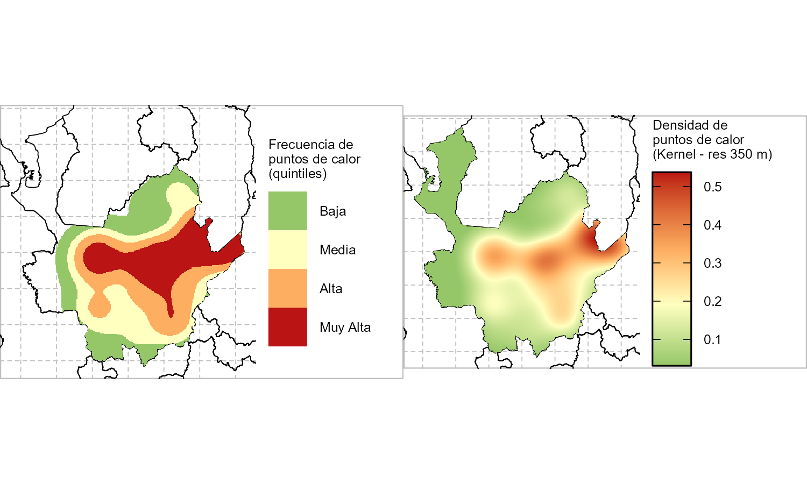
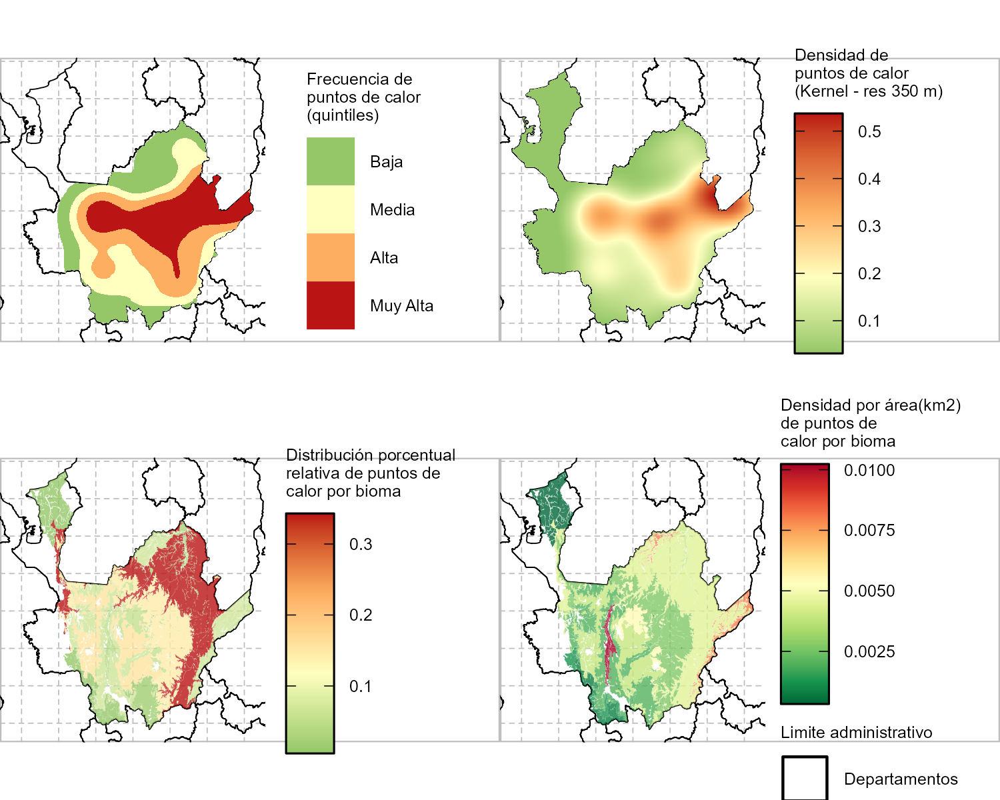

Flujo de trabajo – Análisis general de biodiversidad en puntos de
calor/fuegos en Colombia
================

Este flujo de trabajo se desarrolló para monitorear la biodiversidad
potencial asociada a puntos de fuego en Colombia. Sin embargo, en el
momento que se generó la información de fuegos no estaba disponible, por
lo que se estimó a partir de datos de puntos de calor.

Este flujo permite la estimación de métricas de biodiversidad asociadas
a los puntos que se dispongan en la ventana espacial de análisis
requerida, respaldado en la información de Biomodelos y ecosistemas
amenazados, en relación con Biomas IAvH como unidad ecológica de
análisis. La importancia de este enfoque radica en facilitar un código
para analizar estas dinámicas en diferentes escalas y contextos, siendo
particularmente útil para realizar análisis en diferentes territorios y
apoyar la toma de decisiones de gestión.

El flujo de trabajo está desarrollado en R software y automatizado para
analizarse en cualquier ventana espacial de análisis (por ejemplo,
departamentos) y temporal de análisis (dependiendo de los puntos de
entrada). Este documento parte de un ejemplo con una ventana espacial de
departamento (Antioquia) para la explicación detallada de cada paso, y
finaliza con un loop de estimación para todos los departamentos de
Colombia. Las entradas deben organizarse en una carpeta raíz
[script/input](https://github.com/vicjulrin/MonitoreoFuegosBiodiversidad/tree/main/script/input),
y nombrarse explícitamente en la parte inicial del código. Las salidas
se almacenarán en la carpeta “script/output” sobre la misma raíz del
código.

# Tabla de contenido

- [Organizar directorio de trabajo](#organizar-directorio-de-trabajo)
- [Organizar entorno de trabajo](#organizar-entorno-de-trabajo)
  - [Cargar librerias/paquetes necesarios para el
    análisis](#cargar-libreriaspaquetes-necesarios-para-el-análisis)
  - [Establecer directorios de
    trabajo](#establecer-directorios-de-trabajo)
    - [Definir inputs](#definir-inputs)
- [Cargar insumos BASE](#cargar-insumos-base)
  - [Insumos cartograficos](#insumos-cartograficos)
  - [Insumos Biomodelos](#insumos-biomodelos)
- [Generar mapa base](#generar-mapa-base)
- [Ejemplo - Analisis Individual -
  Antioquia](#ejemplo---analisis-individual---antioquia)
  - [Corte por area de estudio](#corte-por-area-de-estudio)
  - [Analisis de puntos de calor](#analisis-de-puntos-de-calor)
    - [Plot densidad de puntos de
      calor](#plot-densidad-de-puntos-de-calor)
    - [Analisis de puntos por bioma](#analisis-de-puntos-por-bioma)
  - [Análisis de biodiversidad (BIOMODELOS) por puntos de
    calor](#análisis-de-biodiversidad-biomodelos-por-puntos-de-calor)
    - [Riqueza de especies](#riqueza-de-especies)
    - [Riqueza de especies amenazadas](#riqueza-de-especies-amenazadas)
    - [Riqueza de especies endemicas](#riqueza-de-especies-endemicas)
    - [Riqueza de especies exoticas](#riqueza-de-especies-exoticas)
  - [Análisis de ecosistemas amenazados por puntos de
    calor](#análisis-de-ecosistemas-amenazados-por-puntos-de-calor)
  - [Generar Reporte de resultados](#generar-reporte-de-resultados)
- [Ejemplo - Analisis multiple - Loop
  paralelo](#ejemplo---analisis-multiple---loop-paralelo)


<a id="ID_seccion1"></a>

# Organizar directorio de trabajo

Las entradas de ejemplo de este ejercicio están almacenadas en
[IAvH/Unidades
compartidas/INPUTS_GitHub/MonitoreoFuegosBiodiversidad](https://drive.google.com/open?id=1XKQIcf_IPJiRcTjohDumJCnM0V80lciY&usp=drive_fs).
Están organizadas de esta manera que facilita la ejecución del código:

    script
    │- Script Reporte PuntosCalor 2024.R
    │    
    └-input
    │ │
    │ └- Biomodelos2023 # Disponible en http://geonetwork.humboldt.org.co/geonetwork/srv/spa/catalog.search#/metadata/0a1a6bdf-3231-4a77-8031-0dc3fa40f21b
    │ │   └- presente
    │ │   │   │- sp_1.tif
    │ │   │   │- ...        # Archivos de modelos de distribucion de especies
    │ │   │   │- sp_n.tif
    │ │   │- Biomodelos_registros.csv      
    │ │   │- listas_spp_natgeo_sib_2023.csv      
    │ │
    │ │- BIOMA_IAvH.gpkg # Disponible en http://www.ideam.gov.co/web/ecosistemas/mapa-ecosistemas-continentales-costeros-marinos
    │ │- IGAC_Depto.gpkg # Disponible en https://geoportal.igac.gov.co/contenido/datos-abiertos-cartografia-y-geografia
    │ │- PuntosCalor_nats_fire_nrt_1223_01_24.shp # Puntos de interes para el analisis
    │ │- redlist_ecosCol_Etter_2017.tif # Disponible en http://reporte.humboldt.org.co/biodiversidad/2017/cap2/204/
    │ │-TemplateReporte.docx # Plantilla de reporte
    │     
    └-output

# Organizar entorno de trabajo

## Cargar librerias/paquetes necesarios para el análisis

``` r
## Cargar librerias necesarias para el análisis ####
# Lista de librerias necesarias
packages_list<-list("this.path", "magrittr", "dplyr", "plyr", "pbapply", "data.table", "raster", "terra", "sf", "ggplot2", "ggpubr", 
                    "tidyr", "RColorBrewer", "reshape2", "ggnewscale", "MASS", "stars",
                    "tidyterra", "fasterize", "lwgeom", "officer", "ggspatial",
                    "future", "future.apply", "progressr")

## Revisar e instalar librerias necesarias
packagesPrev<- .packages(all.available = TRUE)
lapply(packages_list, function(x) {   if ( ! x %in% packagesPrev ) { install.packages(x, force=T)}    })

## Cargar librerias
lapply(packages_list, library, character.only = TRUE)
```

## Establecer directorios de trabajo

El flujo de trabajo está diseñado para establecer el entorno de trabajo
automáticamente a partir de la ubicación del código. Esto significa que
tomará como “dir_work” la carpeta raiz donde se almacena el código
“~/scripts. De esta manera, se garantiza que la ejecución se realice
bajo la misma organización descrita en el paso de [Organizar el
directorio de trabajo](#ID_seccion1).

``` r
# Establecer directorio
dir_work<- this.path::this.path() %>% dirname() # espacio de trabajo donde se almacena el codigo actual
```

### Definir inputs

Dado que el código está configurado para definir las entradas desde la
carpeta input, en esta parte se debe definir una lista llamada “input”
en la que se especifica el nombre de cada una de las entradas. Para este
ejemplo, basta con usar file.path con referencia a “input_folder” y el
nombre del archivo para definir su ruta y facilitar su carga posterior.
No obstante, se podría definir cualquier ruta de la máquina local como
carpeta input donde se almacenen las entradas, o hacer referencia a cada
archivo directamente.

``` r
# Establecer directorio
dir_work<- this.path::this.path() %>% dirname() # espacio de trabajo donde se almacena el codigo actual

# definir carpeta input
input_folder<- file.path(dir_work, "input"); # "~/input"

input<- list(Bioma_IAvH= file.path(input_folder, "Bioma_IAvH.gpkg"), 
          redlist_ecos= file.path(input_folder,"redlist_ecosCol_Etter_2017.tif"), 
          biomodelos_folder= file.path(input_folder, "Biomodelos2023/presente"),  
          biomodelos_metadata= file.path(input_folder,"Biomodelos2023/listas_spp_natgeo_sib_2023.csv"),
          Biomodelos_records= file.path(input_folder,"Biomodelos2023/Biomodelos_registros.csv"),
          template_reporte= file.path(input_folder,"TemplateReporte.docx"), 
          n_density= 350,
          PuntosCalor= file.path(input_folder,"PuntosCalor_nats_fire_nrt_1223_01_24.shp"),
          IGAC_Deptos= file.path(input_folder, "IGAC_Depto.gpkg")
          )

# crear carpeta output
output<- file.path(dir_work, "output"); dir.create(output)
```

# Cargar insumos BASE

Este código ejecuta una serie de análisis espaciales para los que es
importante tener un sistema de coordenadas equivalente entre los insumos
que optimice el análisis. Toda la información cartográfica de este
ejemplo se maneja en el sistema de coordenadas WGS84 (EPSG:4326)
<https://epsg.io/4326>

## Insumos cartograficos

``` r
# Cargar insumos BASE ####
## Este codigo maneja toda la informacion cartografica en el sistema de coordenadas WGS84 4326 https://epsg.io/4326

sf::sf_use_s2(F) # desactivar el uso de la biblioteca s2 para las operaciones geométricas esféricas. Esto optimiza algunos analisis de sf.

## Insumos cartograficos ####
BiomaIAvH<- st_read(input$Bioma_IAvH)
redlist_ecos<- terra::rast(input$redlist_ecos)
PuntosCalor<- st_read(input$PuntosCalor)
IGAC_Deptos<- st_read(input$IGAC_Deptos)
```

## Insumos Biomodelos

Los insumos de Biomodelos constan de una carpeta “biomodelos_folder”, en
la que se almacenan múltiples archivos raster .tif correspondientes a
modelos de distribución de especies. Cada archivo .tif lleva el nombre
de la especie modelada. Esta carpeta se acompaña de un archivo de
metadatos llamado “biomodelos_metadata”, que contiene información
taxonómica y de amenaza de la especie modelada. Además, existe un
archivo denominado “Biomodelos_records” que contiene registros curados
de especies en Colombia.

Los archivos .tif están alineados en la misma grilla y sistema de
coordenadas, por lo que se pueden cargar todos directamente. Para
hacerlo, primero se utiliza la función list.files con la condición .tif
para obtener todos los modelos, y luego se leen con terra::rast en una
pila de capas. Cada capa se nombra con el nombre del archivo
correspondiente a la especie modelada.

``` r
### Cargar Biomodelos Stack ####
Biomodelos_files<- list.files(input$biomodelos_folder, recursive = T, pattern  = "\\.tif$", full.names = T)
Biomodelos_data<- data.frame(path= Biomodelos_files) %>%  dplyr::mutate(scientificName= sapply(.$path, function(x) strsplit(gsub("_", " ", tools::file_path_sans_ext(basename(x))), " ")[[1]] %>% {paste(.[1], .[2])} ))

Biomodelos_metadata<- data.table::fread(input$biomodelos_metadata)
Biomodelos_metadata2<- list(Biomodelos_metadata, Biomodelos_data) %>% plyr::join_all()

Biomodelos_stack<- terra::rast(Biomodelos_metadata2$path) %>% setNames(Biomodelos_metadata2$scientificName)
print(Biomodelos_stack)
```

    class       : SpatRaster 
    dimensions  : 2003, 1459, 8753  (nrow, ncol, nlyr)
    resolution  : 0.008333333, 0.008333333  (x, y)
    extent      : -79.00833, -66.85, -4.233333, 12.45833  (xmin, xmax, ymin, ymax)
    coord. ref. : lon/lat WGS 84 (EPSG:4326) 
    sources     : Nothocercus_julius_10_MAXENT.tif  
    Nothocercus_bonapartei_10_MAXENT.tif  
    Tinamus_tao_10_MAXENT.tif  
    ... and 8750 more source(s)
    names       : Notho~ulius, Notho~artei, Tinamus tao, Tinam~goodi, Tinam~major, Tinam~tatus, ... 
    min values  :           0,           0,           0,           0,           0,           0, ... 
    max values  :           1,           1,           1,           1,           1,           1, ... 

Los registros, por su parte, provienen de un archivo de datos plano,
pero tienen asociadas coordenadas, lo que permite espacializarlos para
análisis posteriores.

``` r
### Cargar Biomodelos Registros ####
Biomodelos_records<- data.table::fread(input$Biomodelos_records)

#### Espacializar Biomodelos registros
Biomodelos_records_spatial<- dplyr::distinct(Biomodelos_records) %>% st_as_sf(coords = c("record_lon", "record_lat"), crs = 4326)

raster_records_base<- terra::rast(Biomodelos_stack[[1]]) %>% setNames("cell") %>% terra::setValues(seq(ncell(.)))
Biomodelos_records_spatial$cell<- terra::extract(raster_records_base, Biomodelos_records_spatial, xy= F) %>% as.data.frame() %>% {.$cell}
Biomodelos_records_spatial2<- dplyr::filter(Biomodelos_records_spatial, !is.na(cell))
Biomodelos_records_spatial_data<- st_drop_geometry(Biomodelos_records_spatial2)
print(Biomodelos_records_spatial)
```

    Simple feature collection with 421393 features and 3 fields
    Geometry type: POINT
    Dimension:     XY
    Bounding box:  xmin: -82.99951 ymin: -13.99472 xmax: -60.00006 ymax: 12.28139
    Geodetic CRS:  WGS 84
    First 10 features:
      scientificName record_scriptID                   geometry    cell
    1  Baccharis rupicola           14346 POINT (-72.96625 6.027917) 1125615
    2  Baccharis rupicola         1694607 POINT (-74.19808 4.964511) 1312219
    3  Baccharis rupicola         3496011  POINT (-72.7015 7.337306)  896583
    4  Baccharis rupicola         3499063      POINT (-74.001 5.214) 1268472
    5  Baccharis rupicola         3502951   POINT (-74.39528 3.9238) 1494570
    6  Baccharis rupicola         3509565 POINT (-75.27742 5.352639) 1243516
    7  Baccharis rupicola         3509692 POINT (-75.28594 5.343778) 1244974
    8  Baccharis rupicola         3513864 POINT (-73.81136 5.426333) 1230561
    9  Baccharis rupicola         3514111 POINT (-73.86492 5.213139) 1268489
    10 Baccharis rupicola         3530131 POINT (-73.59075 5.403056) 1234965

# Generar mapa base

Para facilitar la visualización de los resultados, se generó un mapa
base con la división administrativa de departamentos en Colombia.

``` r
map_base_plot<- ggplot() + 
  geom_sf(data = IGAC_Deptos, fill = NA, aes(color = "Departamentos"), alpha= 0.5, size = 0.1) + 
  scale_color_manual("Limite administrativo", values = c("Departamentos" = "black"))+
  theme_void()+
  theme(
    plot.background=element_rect( color =  "gray", size= 0.5),
    panel.grid.major = element_line(color = "gray", linetype = 2, size= 0.2),
    legend.margin = margin(r = 5, unit = "mm"),
    text = element_text(size = 6),
    legend.text = element_text(size = 6),
    legend.title = element_text(size = 6)
  )
print(map_base_plot)
```


# Ejemplo - Analisis Individual - Antioquia

El código está automatizado para estimar los análisis en cualquier
ventana espacial de análisis. Aquí se presenta un ejemplo individual
utilizando el departamento de Antioquia como ventana espacial de
análisis. La ventana espacial del departamento de Antioquia se definió a
partir del archivo “IGAC_Deptos”, pero podría definirse a partir de
cualquier archivo espacial en la misma proyección que los insumos de
análisis (WGS84 4326 para este caso). Los resultados se almacenarán en
una carpeta dentro del directorio output, especificada con el nombre del
argumento “name_StudyArea” definido a continuación.

``` r
## Delimitar area de estudio -  Antioquia ####
studyarea<- dplyr::filter(IGAC_Deptos, Depto %in% "Antioquia")

## Definir carpeta donde se guardan los resultados ####
name_StudyArea<- unique(studyarea$Depto)[1] ########### Aca va el nombre del folder donde se guardaran los resultados, en este ejemplo por defecto el poligono de analisis depto
dir_folder_out<- file.path(output, name_StudyArea); dir.create(name_StudyArea)
```

### Corte por area de estudio

``` r
area_analysis<- studyarea  %>% terra::vect() %>% terra::aggregate() %>% st_as_sf() # dissolve corregir geometrias
extent_analysis<- extent(area_analysis)

PuntosCalor_filter<- PuntosCalor %>% sf::st_crop(area_analysis) %>% st_intersection(area_analysis) %>%
  dplyr::mutate( as.data.frame(sf::st_coordinates(.))) %>% dplyr::select(c("X", "Y")) %>% dplyr::distinct() %>% 
  dplyr::mutate(id_point = as.numeric(as.factor(paste(X, Y, sep = "-"))))
```

### Analisis de puntos de calor

Un primer análisis exploratorio nos muestra la distribución de puntos de
calor en el área de estudio.

``` r
PuntosCalor_plot<- map_base_plot+
   geom_sf(data= PuntosCalor_filter, aes(colour= "Puntos de calor"), size= 0.1)+
   scale_color_manual(name = "", values = c("Puntos de calor" = "red"))+
coord_sf(xlim= c(extent_analysis[1], extent_analysis[2]),  
         ylim = c(extent_analysis[3], extent_analysis[4]))

print(PuntosCalor_plot)
```


#### Plot densidad de puntos de calor

Más allá de los puntos, pareció interesante ver, a partir de análisis de
densidad, cómo se están distribuyendo los puntos de calor en el área de
estudio. El análisis se desarrolló a partir de una estimación de
densidad bidimensional de Kernek con bandas definidas en el input
“n_density”, que para este ejemplo es de 350. Para facilitar la
interpretación del resultado, también se generó un mapa por quintiles.

``` r
## Plot densidad de puntos de calor ####
### Estimar densidad ####
densidad <- kde2d(x = PuntosCalor_filter$X, y = PuntosCalor_filter$Y, n = input$n_density, 
                  lims=c(extent(area_analysis)[1:2], extent(area_analysis)[3:4]) ) # n controla la resolución
raster_densidad <- raster(densidad) 
raster_densidad_calor<- terra::mask(terra::rast(raster_densidad), terra::rast(fasterize::fasterize(area_analysis, raster_densidad)))
raster_densidad_calor2<- raster_densidad_calor       

### Estimar cuantiles ####
valores <- values(raster_densidad_calor)[,1,drop= T] %>% na.omit()   # A
cuantiles <- quantile(valores, probs = seq(0, 1, 0.20), type= 7)
categorias_cuantiles <- cut(valores, breaks = unique(cuantiles), include.lowest = F, labels = FALSE) %>% unlist()

if(length(unique(na.omit(categorias_cuantiles))) == 1){
  categorias_cuantiles[!is.na(categorias_cuantiles)]<- 4
  cuantiles[4]<-max(cuantiles)
}

### Mapa por cuantiles ####

df_raster <- xyFromCell(raster_densidad_calor, cell = cells(raster_densidad_calor)) %>% as.data.frame() %>% 
  dplyr::mutate(values= valores, cell = cells(raster_densidad_calor), Cuantil = categorias_cuantiles)

raster_cuantiles_coltab<- data.frame(value= 2:5, cuantil_val= cuantiles[2:5],  label= c("Baja", "Media", "Alta", "Muy Alta"),
                                     col= c("#95C768", "#FFFFBF", "#fdae61", "#BA1414"))

raster_cuantiles<- terra::rast(raster_densidad_calor)
raster_cuantiles[df_raster$cell]<- df_raster$Cuantil
raster_densidad_calor[raster_cuantiles==1]<- NA; raster_cuantiles[raster_cuantiles==1]<- NA

raster_cuantiles_aes<- raster_cuantiles
levels(raster_cuantiles_aes)<- dplyr::select(raster_cuantiles_coltab, c("value", "label"))
coltab(raster_cuantiles_aes)<- dplyr::select(raster_cuantiles_coltab, c("value", "col"))

map_densidad_q_calor<- map_base_plot+
  guides(color = "none") + ggnewscale::new_scale_fill()+
  geom_spatraster(data=raster_cuantiles_aes)+
  labs(fill = "Frecuencia de\npuntos de calor\n(quintiles)")+
  coord_sf(xlim= c(extent_analysis[1], extent_analysis[2]), ylim = c(extent_analysis[3], extent_analysis[4]) )


map_densidad_calor<-    map_base_plot +   guides(color = "none")+ ggnewscale::new_scale_fill()+
  stars::geom_stars(data=  stars::st_as_stars(raster_densidad_calor2))+
  scale_fill_gradientn("Densidad de\npuntos de calor\n(Kernel - res 350 m)", na.value = NA,
                       colours = raster_cuantiles_coltab$col,
                       values= scales::rescale(raster_cuantiles_coltab$cuantil_val),
                       limits = c(min(raster_cuantiles_coltab$cuantil_val, na.rm = TRUE), max(cuantiles, na.rm = TRUE)),
                       oob = scales::oob_squish, 
                       guide = guide_colorbar(order = 1, frame.colour = "black", ticks.colour = "black")
  )+
  coord_sf(xlim= c(extent_analysis[1], extent_analysis[2]), ylim = c(extent_analysis[3], extent_analysis[4]) )

comp_map_density<- ggarrange(plotlist = list(map_densidad_q_calor, map_densidad_calor), nrow = 1, ncol=2)
print(comp_map_density)
```



#### Analisis de puntos por bioma

Se analizaron los números de puntos de calor en diferentes biomas del
área de estudio. Para ello, se realizaron dos estimaciones:

Proporción de puntos de calor por bioma: Esta métrica calcula la
proporción de puntos de calor que se encuentran en cada bioma en
relación con el total de puntos de calor en toda el área de estudio.
Esto nos permite entender qué biomas tienen una mayor concentración
relativa de puntos de calor.

Densidad de puntos de calor por área del bioma: Esta métrica calcula la
densidad de puntos de calor en cada bioma, es decir, el número de puntos
de calor por el área de cada bioma. Esto nos permite entender cuales son
los biomas mas afectados por puntos de calor en razon de su tamaño.

Ambas estimaciones son útiles para identificar y comparar la
distribución y concentración de puntos de calor en los distintos biomas
del área de estudio.

``` r
##  Analisis de puntos por bioma ####

## Corte de bioma por area de estudio ####
test_crop_area_analysis<- BiomaIAvH  %>%  st_crop( area_analysis )
test_intersects_area_analysis<- sf::st_intersects(area_analysis, test_crop_area_analysis) %>% as.data.frame()
BiomaIAvH_area_analysis<- st_intersection(area_analysis[unique(test_intersects_area_analysis$row.id)], test_crop_area_analysis[test_intersects_area_analysis$col.id,]) %>% dplyr::select(BIOMA_IAvH)

### Area de bioma por area de estudio ####
BiomaIAvH_area_data<-BiomaIAvH_area_analysis %>% dplyr::mutate(area= st_area(.) %>%  units::set_units("km2")) %>% st_drop_geometry()  %>%  dplyr::group_by(BIOMA_IAvH) %>% dplyr::summarise(area= sum(area))
BiomaIAvH_area_analysis_v2<- list(as.data.frame(BiomaIAvH_area_analysis), BiomaIAvH_area_data) %>% plyr::join_all() %>% st_as_sf()


### Puntos de calor por bioma ####
test_biom<- st_intersects( PuntosCalor_filter, BiomaIAvH_area_analysis) %>% as.data.frame()
BiomaIAvH_puntos<- PuntosCalor_filter %>% dplyr::mutate(BIOMA_IAvH= st_drop_geometry(BiomaIAvH_area_analysis_v2)[test_biom$col.id,"BIOMA_IAvH"])
BiomaIAvH_puntos$cell <- terra::extract( raster_records_base, BiomaIAvH_puntos, xy=T)$cell 

#### Proporcion de puntos de calor por bioma ####
BiomaIAvH_puntos_data <-BiomaIAvH_puntos %>% st_drop_geometry() %>% dplyr::group_by(BIOMA_IAvH) %>%
  dplyr::summarise(n_points_calor = n()) %>% dplyr::mutate(prop_puntos_total = n_points_calor/ sum(.$n_points_calor)) %>% dplyr::arrange(-prop_puntos_total)
BiomaIAvH_puntos_summary<- list(BiomaIAvH_puntos_data,BiomaIAvH_area_data) %>% plyr::join_all() %>% dplyr::mutate(area_km2= as.numeric(area)) %>% dplyr::mutate(density_points_km2= n_points_calor/ area_km2) %>% dplyr::select(-area)

BiomaIAvH_puntos_data_export<- BiomaIAvH_puntos_data %>% setNames(c("Bioma IAvH", "No. de puntos de calor", "Prop. de puntos")) %>% as.data.frame()
BiomaIAvH_puntos_summary_export<- BiomaIAvH_puntos_summary_density %>%  setNames(c("Bioma IAvH", "Área (km2)", "Densidad de puntos por área")) %>% as.data.frame()

#### Mapa de proporcion de puntos por bioma respecto al total de puntos en el area de estudio ####

BiomaIAvH_puntos_summary_sf<- list(as.data.frame(BiomaIAvH_area_analysis_v2), BiomaIAvH_puntos_summary) %>% plyr::join_all() %>% dplyr::mutate(across(where(is.numeric), ~replace_na(., 0))) %>% st_as_sf()
BiomaIAvH_puntos_summary_data<- st_drop_geometry(BiomaIAvH_puntos_summary_sf)

map_prop_puntos_Bioma_IAvH<-  map_base_plot + 
  guides(color = "none")+
  ggnewscale::new_scale_fill()+
  geom_sf(data= BiomaIAvH_puntos_summary_sf %>% dplyr::filter(prop_puntos_total>0), aes( fill = prop_puntos_total), color= NA, alpha= 0.8) +
  coord_sf(xlim= c(extent_analysis[1], extent_analysis[2]), 
           ylim = c(extent_analysis[3], extent_analysis[4]) )+
  scale_fill_gradientn( "Distribución porcentual\nrelativa de puntos de\ncalor por bioma" , colours = raster_cuantiles_coltab$col, guide = guide_colorbar(order = 2, override.aes = list(size = 3), frame.colour = "black", ticks.colour = "black") )

#### Mapa de densidad de puntos por area km del area de estudio ####
map_dens_puntos_area_Bioma<-     map_base_plot + ggnewscale::new_scale_fill()+
  geom_sf(data= BiomaIAvH_puntos_summary_sf %>% dplyr::filter(prop_puntos_total>0), aes( fill = density_points_km2), color= NA, alpha= 0.8) +
  coord_sf(xlim= c(extent_analysis[1], extent_analysis[2]), 
           ylim = c(extent_analysis[3], extent_analysis[4]) )+
  scale_fill_gradientn("Densidad por área(km2)\nde puntos de\ncalor por bioma", colors = rev(brewer.pal(n = 11, name = "RdYlGn")), guide = guide_colorbar(order = 1, override.aes = list(size = 3), frame.colour = "black", ticks.colour = "black"))


#### Mapa compilado de puntos de calor ####

map_compiled_densidad_calor<- ggarrange(plotlist = 
                                          list(map_densidad_q_calor,
                                               map_densidad_calor,
                                               map_prop_puntos_Bioma_IAvH,
                                               map_dens_puntos_area_Bioma), ncol = 2, nrow =  2, align =  "v" , common.legend = F) 

print(map_compiled_densidad_calor)
```



Las tablas que sustentan estos resultados:

``` r
print(BiomaIAvH_puntos_data_export)
```

                                                            Bioma IAvH No. de puntos de calor Prop. de puntos
    1                        Zonobioma Humedo Tropical Nechí-San Lucas                     62     0.342541436
    2                                       Orobioma Andino Cauca alto                     28     0.154696133
    3                               Orobioma Subandino Nechí-San Lucas                     26     0.143646409
    4                                    Orobioma Subandino Cauca alto                     12     0.066298343
    5  Zonobioma Humedo Tropical Magdalena medio y depresión momposina                     12     0.066298343
    6                  Helobioma Magdalena medio y depresión momposina                     11     0.060773481
    7                                  Orobioma Andino Nechí-San Lucas                     10     0.055248619
    8                     Zonobioma Alternohigrico Tropical Cauca alto                      7     0.038674033
    9                                        Helobioma Nechí-San Lucas                      5     0.027624309
    10                              Orobioma Andino Cordillera central                      3     0.016574586
    11                           Orobioma Subandino Cordillera central                      2     0.011049724
    12                    Orobioma Andino Estribaciones Pacífico norte                      1     0.005524862
    13                 Orobioma Subandino Estribaciones Pacífico norte                      1     0.005524862
    14                                  Zonobioma Humedo Tropical Sinú                      1     0.005524862

``` r
print(BiomaIAvH_puntos_summary_export)
```

                                                            Bioma IAvH Área (km2) Densidad de puntos por área
    1                     Zonobioma Alternohigrico Tropical Cauca alto   684.9600                0.0102195752
    2                  Helobioma Magdalena medio y depresión momposina  1372.0964                0.0080169296
    3                                  Orobioma Andino Nechí-San Lucas  1836.1370                0.0054462168
    4  Zonobioma Humedo Tropical Magdalena medio y depresión momposina  2656.7584                0.0045167825
    5                        Zonobioma Humedo Tropical Nechí-San Lucas 13857.3557                0.0044741581
    6                            Orobioma Subandino Cordillera central   464.5353                0.0043053783
    7                                        Helobioma Nechí-San Lucas  1256.8344                0.0039782490
    8                                       Orobioma Andino Cauca alto  7136.7475                0.0039233558
    9                               Orobioma Subandino Nechí-San Lucas  9561.9312                0.0027191160
    10                              Orobioma Andino Cordillera central  1491.5909                0.0020112753
    11                                   Orobioma Subandino Cauca alto  6024.8791                0.0019917412
    12                 Orobioma Subandino Estribaciones Pacífico norte   812.9423                0.0012300996
    13                    Orobioma Andino Estribaciones Pacífico norte  1170.8741                0.0008540628
    14                                  Zonobioma Humedo Tropical Sinú  2899.6947                0.0003448639

### Análisis de biodiversidad (BIOMODELOS) por puntos de calor

A partir de los datos de Biomodelos, se analizó la correspondencia entre
puntos de calor y biodiversidad. Para ello, se hizo una aproximación
usando el bioma como unidad de análisis. Se estimaron dos métricas para
los biomas que presentan al menos un punto de calor:

Riqueza de especies estimada a partir de modelos: Se sumó el número de
capas de modelos de distribución de especies que corresponden con biomas
que tienen reporte de puntos de calor. Riqueza de especies a partir de
registros históricos curados: Se contó el número de especies en los
registros históricos curados que están presentes en los biomas con
puntos de calor.

Estas estimaciones permiten evaluar la relación entre la presencia de
puntos de calor y la riqueza de especies en diferentes biomas. Los
píxeles (1km2) en los que se sobreponen registros históricos con puntos
de calor en la ventana temporal de análisis fueron resaltados como
puntos de color morado en las salidas gráficas. Además, a partir de los
modelos, se generaron histogramas de densidad de puntos de calor en
función de la riqueza de especies estimada por los modelos de
distribución. Estos histogramas se construyeron tomando como referencia
los píxeles donde se encontraron los puntos de calor, proporcionando una
visualización clara de cómo varía la densidad de puntos de calor con
respecto a la riqueza de especies en esos lugares.

Este ejercicio se realizó con la riqueza total de especies, así como con
la riqueza de especies endémicas, amenazadas y exóticas. Para clasificar
las especies, se utilizó el archivo de metadatos de los modelos,
denominado “biomodelos_metadata”, que corresponde a
“listas_spp_natgeo_sib_2023.csv” descargado desde GeoNetwork.

#### Riqueza de especies

``` r
### Riqueza de especies ####

#### Riqueza de especies a partir de registros ####
records_matriz_area<- terra::extract( raster_records_base, PuntosCalor_filter) %>%  dplyr::mutate(id_point= PuntosCalor_filter$id_point)
records_data_area<- records_matriz_area %>% list(Biomodelos_records_spatial_data) %>% 
  plyr::join_all() %>% dplyr::filter(!is.na(scientificName)) %>% dplyr::select(-c( "ID")) %>% dplyr::mutate(variable= "biomodelos_records")
biomodelos_data_record<- list(as.data.frame(BiomaIAvH_puntos), records_data_area, Biomodelos_metadata) %>% 
  plyr::join_all()

##### Riqueza de especies con registros  - por Bioma ####
records_bioma_summary_sp<- st_drop_geometry(biomodelos_data_record) %>% dplyr::group_by(BIOMA_IAvH) %>%
  dplyr::summarise(n_species_records_bioma = n_distinct(scientificName))

records_bioma_summary_sp_uicn<- st_drop_geometry(biomodelos_data_record) %>% dplyr::filter(threatStatus_UICN %in% c("EN", "CR", "VU")) %>% 
  dplyr::group_by(BIOMA_IAvH) %>% dplyr::summarise(n_species_uicn_records_bioma = n_distinct(scientificName))

## Registros en zonas con puntos de calor
species_records_bioma<- dplyr::filter(biomodelos_data_record, !is.na(scientificName))

BiomaIAvH_richness_summary_sf<- list( as.data.frame(BiomaIAvH_puntos_summary_sf),
                                      records_bioma_summary_sp,
                                      records_bioma_summary_sp_uicn ) %>% plyr::join_all() %>% st_as_sf()


##### Plot Riqueza de especies con registros  - por Bioma #####
map_richness_sp_records_Bioma <-    map_base_plot + 
  ggnewscale::new_scale_fill()+
  geom_sf(data= BiomaIAvH_richness_summary_sf, aes( fill = n_species_records_bioma),
          color= NA, alpha= 0.8) +
  scale_fill_gradientn("No. especies registradas\npor Bioma con puntos\nde calor\n(registros historicos)", colors = brewer.pal(n = 11, name = "Blues"), 
                       na.value= NA, guide = guide_colorbar(order = 1, frame.colour = "black", ticks.colour = "black"))+
  coord_sf(xlim= c(extent_analysis[1], extent_analysis[2]), 
           ylim = c(extent_analysis[3], extent_analysis[4]) ) +
  ggnewscale::new_scale_color()+
  geom_point(data= species_records_bioma, aes(x=X, y=Y, color= "purple"), size= 0.8,
             alpha= 0.8, shape= 17)+
  scale_color_manual("", values = c("purple" = "purple"), labels= "Registros historicos\nen zonas de puntos\nde calor", guide = guide_legend(order = 2, override.aes = list(size = 3)))


#### Riqueza de especies con modelos  - por Bioma ####
biomodelos_matriz_area<- terra::extract(Biomodelos_stack, PuntosCalor_filter, xy= T) %>% dplyr::select(-"ID") 
biomodelos_presencia <- biomodelos_matriz_area  %>% dplyr::mutate(id_point= PuntosCalor_filter$id_point) %>%
  melt(id.vars = c("id_point"), variable.name = "scientificName") %>% dplyr::filter(value > 0) %>% dplyr::filter(!is.na(scientificName)) %>% dplyr::select(-value) %>% 
  dplyr::mutate(variable= "biomodelos_map")
biomodelos_data_model<- list(as.data.frame(BiomaIAvH_puntos), biomodelos_presencia, Biomodelos_metadata) %>% 
  plyr::join_all() 

models_bioma_summary_sp<- st_drop_geometry(biomodelos_data_model) %>% dplyr::group_by(BIOMA_IAvH) %>%
  dplyr::summarise(n_species_models_bioma = n_distinct(scientificName))

models_bioma_summary_sp_uicn<- st_drop_geometry(biomodelos_data_model) %>% dplyr::filter(threatStatus_UICN %in% c("EN", "CR", "VU")) %>% 
  dplyr::group_by(BIOMA_IAvH) %>% dplyr::summarise(n_species_uicn_models_bioma = n_distinct(scientificName))

species_models_bioma<- dplyr::filter(biomodelos_data_model, !is.na(scientificName))

BiomaIAvH_richness_summary_model_sf<- list( as.data.frame(BiomaIAvH_richness_summary_sf),
                                            models_bioma_summary_sp,
                                            models_bioma_summary_sp_uicn
) %>% plyr::join_all() %>%  st_as_sf()

##### Plot Riqueza de especies con modelos  - por Bioma #####
map_richness_sp_models_Bioma <-    map_base_plot + 
  guides(color = "none")+
  ggnewscale::new_scale_fill()+
  geom_sf(data= BiomaIAvH_richness_summary_model_sf, aes( fill = n_species_models_bioma),
          color= NA, alpha= 0.8) +
  scale_fill_gradientn("Riqueza estimada de\nespecies por Bioma en\nzonas de puntos de calor\n(Mapas de distribución)", colors = brewer.pal(n = 11, name = "Blues"), 
                       na.value= NA, guide = guide_colorbar(order = 1, frame.colour = "black", ticks.colour = "black"))+
  coord_sf(xlim= c(extent_analysis[1], extent_analysis[2]), 
           ylim = c(extent_analysis[3], extent_analysis[4]) ) +
  ggnewscale::new_scale_color()


#### Densidad Riqueza de especies con modelos  - por Bioma #####

data_coords_richness<- biomodelos_data_model %>% dplyr::group_by(id_point) %>% dplyr::summarise(n= n_distinct(scientificName))

richness_density_plot<- ggplot(data_coords_richness, aes(x = n)) +
  geom_density(fill = "blue", alpha = 0.5, bw = 0.5, color= NA) +
  labs(x = "Riqueza de especies estimada (Mapas de distribución)", y = "Densidad de\npuntos de calor") +
  annotate("text", size=3, x = -Inf, y = Inf, hjust= 0, vjust= 1,
           label =  paste0("N= ",  unique(nrow(data_coords_richness)), "\nBanwidth= 0.5") ) +
  theme_minimal()+
  theme(
    text = element_text(size = 6),
    axis.text.y = element_text(angle = 90)
  )


#### Plot compilado Riqueza de especies  - por Bioma #####
map_compiled_richness_sp<- ggarrange(plotlist =  list(richness_density_plot,
                                                      ggarrange(plotlist = list(map_richness_sp_models_Bioma,
                                                                                map_richness_sp_records_Bioma),
                                                                ncol = 2, nrow = 1, common.legend = F, align = "h")),
                                     nrow = 2, heights  = c(1/3, 2/3)
)

print(map_compiled_richness_sp)
```


#### Riqueza de especies amenazadas

``` r
## Riqueza de sp amenazadas ####

##### Plot Riqueza de sp amenazadas con registros  - por Bioma #####
species_records_bioma_UICN<- species_records_bioma %>%  dplyr::filter(threatStatus_UICN %in% c("EN", "CR", "VU")) 

map_richnessUICN_sp_records_Bioma <-    map_base_plot + 
  guides(color = "none")+
  ggnewscale::new_scale_fill()+
  geom_sf(data= BiomaIAvH_richness_summary_sf, aes( fill = n_species_uicn_records_bioma),
          color= NA, alpha= 0.8) +
  scale_fill_gradientn("No. especies amenazadas\nregistradas por Bioma con\n puntos de calor\n(registros historicos)", colors = brewer.pal(n = 11, name = "Reds"), 
                       na.value= NA, guide = guide_colorbar(order = 1, frame.colour = "black", ticks.colour = "black"))+
  coord_sf(xlim= c(extent_analysis[1], extent_analysis[2]), 
           ylim = c(extent_analysis[3], extent_analysis[4]) ) +
  ggnewscale::new_scale_color()+
  geom_point(data= species_records_bioma_UICN, aes(x=X, y=Y, color= "brown"), size= 0.8,
             alpha= 0.8, shape= 17)+
  scale_color_manual("", values = c("brown" = "purple"), labels= "Registros historicos de\nespecies amenazadas\nen zonas de puntos\nde calor", guide = guide_legend(order = 2, override.aes = list(size = 3)))


##### Plot Riqueza de sp amenazadas con modelos  - por Bioma #####
map_richnessUICN_sp_models_Bioma <-    map_base_plot + 
  guides(color = "none")+
  ggnewscale::new_scale_fill()+
  geom_sf(data= BiomaIAvH_richness_summary_model_sf, aes( fill = n_species_uicn_models_bioma),
          color= NA, alpha= 0.8) +
  scale_fill_gradientn("Riqueza estimada de\nespecies amenazadas por\nBioma con puntos de calor\n(Mapas de distribución)", colors = brewer.pal(n = 11, name = "Reds"), 
                       na.value= NA, guide = guide_colorbar(order = 1, frame.colour = "black", ticks.colour = "black"))+
  coord_sf(xlim= c(extent_analysis[1], extent_analysis[2]), 
           ylim = c(extent_analysis[3], extent_analysis[4]) ) +
  ggnewscale::new_scale_color()


#### Densidad Riqueza de sp amenazadas con modelos  - por Bioma #####
data_coords_richnessUICN<- biomodelos_data_model %>% dplyr::filter(threatStatus_UICN %in% c("EN", "CR", "VU")) %>%
  dplyr::group_by(id_point) %>% dplyr::summarise(n= n_distinct(scientificName))

richnessUICN_density_plot<- ggplot(data_coords_richnessUICN, aes(x = n)) +
  geom_density(fill = "red", alpha = 0.6, bw = 0.5, color= NA) +
  labs(x = "Riqueza estimada de de especies amenazadas (Mapas de distribución)", y = "Densidad de\npuntos de calor") +
  annotate("text", size=3, x = -Inf, y = Inf, hjust= 0, vjust= 1,
           label =  paste0("N= ",  unique(nrow(data_coords_richnessUICN)), "\nBanwidth= 0.5") ) +
  theme_minimal()+
  theme(
    text = element_text(size = 6),
    axis.text.y = element_text(angle = 90)
  )


#### Plot compilado Riqueza de sp amenazadas  - por Bioma #####
map_compiled_richnessUICN_sp<- ggarrange(plotlist =  list(richnessUICN_density_plot,
                                                          ggarrange(plotlist = list(map_richnessUICN_sp_records_Bioma,
                                                                                    map_richnessUICN_sp_models_Bioma),
                                                                    ncol = 2, nrow = 1, common.legend = F, align = "h")),
                                         nrow = 2, heights  = c(1/3, 2/3)
)

print(map_compiled_richnessUICN_sp)
```


#### Riqueza de especies endemicas

``` r
## Riqueza de sp endemicas ####

##### Plot Riqueza de sp endemicas con registros  - por Bioma #####

records_bioma_summary_sp_endemicas<- st_drop_geometry(biomodelos_data_record) %>% dplyr::filter(endemic  %in% "End\xe9mica") %>% 
  dplyr::group_by(BIOMA_IAvH) %>% dplyr::summarise(n_species_endemicas_records_bioma = n_distinct(scientificName))


BiomaIAvH_richnessendemicas_summary_sf<-list( as.data.frame(BiomaIAvH_puntos_summary_sf),
                                              records_bioma_summary_sp_endemicas
) %>% plyr::join_all() %>%  st_as_sf()


species_records_bioma_endemicas<- species_records_bioma %>%  dplyr::filter(endemic  %in% "End\xe9mica")


map_richnessendemicas_sp_records_Bioma <-    map_base_plot + 
  guides(color = "none")+
  ggnewscale::new_scale_fill()+
  geom_sf(data= BiomaIAvH_richnessendemicas_summary_sf, aes( fill = n_species_endemicas_records_bioma),
          color= NA, alpha= 0.8) +
  scale_fill_gradientn("No. especies endemicas\nregistradas por Bioma con\n puntos de calor\n(registros historicos)", colors =  brewer.pal(n = 11, name = "Greens"), 
                       na.value= NA, guide = guide_colorbar(order = 1, frame.colour = "black", ticks.colour = "black"))+
  coord_sf(xlim= c(extent_analysis[1], extent_analysis[2]), 
           ylim = c(extent_analysis[3], extent_analysis[4]) ) +
  ggnewscale::new_scale_color()+
  geom_point(data= species_records_bioma_endemicas, aes(x=X, y=Y, color= "brown"), size= 0.8,
             alpha= 0.8, shape= 17)+
  scale_color_manual("", values = c("brown" = "purple"), labels= "Registros historicos de\nespecies endemicas\nen zonas de puntos\nde calor", guide = guide_legend(order = 2, override.aes = list(size = 3)))


##### Plot Riqueza de sp endemicas con modelos  - por Bioma #####
models_bioma_summary_sp_endemicas<- st_drop_geometry(biomodelos_data_model) %>% dplyr::filter(endemic  %in% "End\xe9mica") %>% 
  dplyr::group_by(BIOMA_IAvH) %>% dplyr::summarise(n_species_models_records_bioma = n_distinct(scientificName))

BiomaIAvH_richnessendemicas_summary_model_sf<- list( as.data.frame(BiomaIAvH_puntos_summary_sf),
                                                     models_bioma_summary_sp_endemicas
) %>% plyr::join_all() %>%  st_as_sf()


map_richnessendemicas_sp_models_Bioma <-    map_base_plot + 
  guides(color = "none")+
  ggnewscale::new_scale_fill()+
  geom_sf(data= BiomaIAvH_richnessendemicas_summary_model_sf, aes( fill = n_species_models_records_bioma),
          color= NA, alpha= 0.8) +
  scale_fill_gradientn("Riqueza estimada de\nespecies endemicas por\nBioma con puntos de calor\n(Mapas de distribución)", colors = brewer.pal(n = 11, name = "Greens"), 
                       na.value= NA, guide = guide_colorbar(order = 1, frame.colour = "black", ticks.colour = "black"))+
  coord_sf(xlim= c(extent_analysis[1], extent_analysis[2]), 
           ylim = c(extent_analysis[3], extent_analysis[4]) ) +
  ggnewscale::new_scale_color()

#### Densidad Riqueza de sp endemicas con modelos  - por Bioma #####
data_coords_richnessendemicas<- biomodelos_data_model %>% dplyr::filter(endemic  %in% "End\xe9mica") %>%
  dplyr::group_by(id_point) %>% dplyr::summarise(n= n_distinct(scientificName))

richnessendemicas_density_plot<- ggplot(data_coords_richnessendemicas, aes(x = n)) +
  geom_density(fill = "darkgreen", alpha = 0.6, bw = 0.5, color= NA) +
  labs(x = "No. estimado de especies endemicas (Mapas de distribución)", y = "Densidad de\npuntos de calor") +
  annotate("text", size=3, x = -Inf, y = Inf, hjust= 0, vjust= 1,
           label =  paste0("N= ",  unique(nrow(data_coords_richnessendemicas)), "\nBanwidth= 0.5") ) +
  theme_minimal()+
  theme(
    text = element_text(size = 6),
    axis.text.y = element_text(angle = 90)
  )

#### Plot compilado Riqueza de sp endemicas  - por Bioma #####
map_compiled_richnessendemicas_sp<- ggarrange(plotlist =  list(richnessendemicas_density_plot,
                                                               ggarrange(plotlist = list(map_richnessendemicas_sp_records_Bioma,
                                                                                         map_richnessendemicas_sp_models_Bioma),
                                                                         ncol = 2, nrow = 1, common.legend = F, align = "h")),
                                              nrow = 2, heights  = c(1/3, 2/3)
)

print(map_compiled_richnessendemicas_sp)
```


#### Riqueza de especies exoticas

``` r
## Riqueza de sp exoticas ####

##### Plot Riqueza de sp exoticas con registros  - por Bioma #####
records_bioma_summary_sp_exoticas<- st_drop_geometry(biomodelos_data_record) %>% dplyr::filter(especies_exoticas %in% "Ex\xf3tica") %>% 
  dplyr::group_by(BIOMA_IAvH) %>% dplyr::summarise(n_species_exoticas_records_bioma = n_distinct(scientificName))


BiomaIAvH_richnessexoticas_summary_sf<-list( as.data.frame(BiomaIAvH_puntos_summary_sf),
                                             records_bioma_summary_sp_exoticas
) %>% plyr::join_all() %>%  st_as_sf()

species_records_bioma_exoticas<- species_records_bioma %>%  dplyr::filter(especies_exoticas %in% "Ex\xf3tica")

map_richnessexoticas_sp_records_Bioma <-    map_base_plot + 
  guides(color = "none")+
  ggnewscale::new_scale_fill()+
  geom_sf(data= BiomaIAvH_richnessexoticas_summary_sf, aes( fill = n_species_exoticas_records_bioma),
          color= NA, alpha= 0.8) +
  scale_fill_gradientn("No. especies exoticas\nregistradas por Bioma con\n puntos de calor\n(registros historicos)", colors =  rev(c("#a78b5e", "#ccb27a", "#f0d586", "#ffd700")), 
                       na.value= NA, guide = guide_colorbar(order = 1, frame.colour = "black", ticks.colour = "black"))+
  coord_sf(xlim= c(extent_analysis[1], extent_analysis[2]), 
           ylim = c(extent_analysis[3], extent_analysis[4]) ) +
  ggnewscale::new_scale_color()+
  geom_point(data= species_records_bioma_exoticas, aes(x=X, y=Y, color= "brown"), size= 0.8,
             alpha= 0.8, shape= 17)+
  scale_color_manual("", values = c("brown" = "purple"), labels= "Registros historicos de\nespecies exoticas\nen zonas de puntos\nde calor", guide = guide_legend(order = 2, override.aes = list(size = 3)))

##### Plot Riqueza de sp exoticas con modelos  - por Bioma #####

models_bioma_summary_sp_exoticas<- st_drop_geometry(biomodelos_data_model) %>% dplyr::filter(especies_exoticas %in% "Ex\xf3tica") %>% 
  dplyr::group_by(BIOMA_IAvH) %>% dplyr::summarise(n_species_models_records_bioma = n_distinct(scientificName))

BiomaIAvH_richnessexoticas_summary_model_sf<- list( as.data.frame(BiomaIAvH_puntos_summary_sf),
                                                    models_bioma_summary_sp_exoticas
) %>% plyr::join_all() %>%  st_as_sf()


map_richnessexoticas_sp_models_Bioma <-    map_base_plot + 
  guides(color = "none")+
  ggnewscale::new_scale_fill()+
  geom_sf(data= BiomaIAvH_richnessexoticas_summary_model_sf, aes( fill = n_species_models_records_bioma),
          color= NA, alpha= 0.8) +
  scale_fill_gradientn("Riqueza estimada de\nespecies exoticas por\nBioma con puntos de calor\n(Mapas de distribución)", colors = rev(c("#a78b5e", "#ccb27a", "#f0d586", "#ffd700")), 
                       na.value= NA, guide = guide_colorbar(order = 1, frame.colour = "black", ticks.colour = "black"))+
  coord_sf(xlim= c(extent_analysis[1], extent_analysis[2]), 
           ylim = c(extent_analysis[3], extent_analysis[4]) ) +
  ggnewscale::new_scale_color()


#### Densidad Riqueza de sp exoticas con modelos  - por Bioma #####
data_coords_richnessexoticas<- biomodelos_data_model %>% dplyr::filter(especies_exoticas %in% "Ex\xf3tica") %>%
  dplyr::group_by(id_point) %>% dplyr::summarise(n= n_distinct(scientificName))

richnessexoticas_density_plot<- ggplot(data_coords_richnessexoticas, aes(x = n)) +
  geom_density(fill = "gold", alpha = 0.6, bw = 0.5, color= NA) +
  labs(x = "No. estimado de especies exoticas (Mapas de distribución)", y = "Densidad de\npuntos de calor") +
  annotate("text", size=3, x = -Inf, y = Inf, hjust= 0, vjust= 1,
           label =  paste0("N= ",  unique(nrow(data_coords_richnessexoticas)), "\nBanwidth= 0.5") ) +
  theme_minimal()+
  theme(
    text = element_text(size = 6),
    axis.text.y = element_text(angle = 90)
  )

#### Plot compilado Riqueza de sp exoticas  - por Bioma #####

map_compiled_richnessexoticas_sp<- ggarrange(plotlist =  list(richnessexoticas_density_plot,
                                                              ggarrange(plotlist = list(map_richnessexoticas_sp_records_Bioma,
                                                                                        map_richnessexoticas_sp_models_Bioma),
                                                                        ncol = 2, nrow = 1, common.legend = F, align = "h")),
                                             nrow = 2, heights  = c(1/3, 2/3)
)

print(map_compiled_richnessexoticas_sp)
```


## Análisis de ecosistemas amenazados por puntos de calor

Se analizó la correspondencia entre puntos de calor y ecosistemas
amenazados en el área de estudio. Este análisis permite identificar los
ecosistemas amenazados con mayor cantidad de puntos de calor,
facilitando la toma de decisiones para la conservación y gestión de esos
ecosistemas para priorizar acciones de protección y mitigación en las
áreas más críticas.

``` r
##  Análisis de ecosistemas amenazados por puntos de calor ####
### Corte Ecosistemas amenazados por area de estudio ####
redlist_ecos_studyarea<- redlist_ecos %>% terra::crop(area_analysis)
studyarea_raster<- area_analysis %>% fasterize::fasterize(raster(redlist_ecos_studyarea)) %>% terra::rast()
redlist_ecos_studyarea2<- terra::mask(redlist_ecos_studyarea, studyarea_raster)

### Conteo de puntos de calor por ecosistema ####
filter_vals<- terra::freq(redlist_ecos_studyarea2)
dat_levels<-  data.frame(ID=1:4, Nivel=c("Critico", "En Peligro", "Preocupación\nmenor", "Vulnerable"), 
                         colors= c("red", "orange", "darkgreen", "gold"),
                         stringsAsFactors=FALSE) %>% dplyr::filter(ID %in% filter_vals$value)

ecosistemas_redlist_data <- terra::extract(redlist_ecos_studyarea2, PuntosCalor_filter, xy= T)

points_amenazados <- PuntosCalor_filter %>% dplyr::mutate(RedListEco= ecosistemas_redlist_data$RedListEco) %>%  dplyr::filter(!is.na(RedListEco)) %>% 
  dplyr::filter(! RedListEco %in% "Preocupación\nmenor" ) %>%  dplyr::filter(! RedListEco %in% 3 )

dat_levels2<- dat_levels %>% dplyr::mutate(RedListEco= ID )

ecosistemas_redlist_data_summ<- ecosistemas_redlist_data %>% dplyr::select(-"ID") %>% 
  dplyr::filter(!is.na(RedListEco)) %>% group_by(RedListEco) %>% dplyr::summarise(n= n()) %>% 
  list(dat_levels2) %>% plyr::join_all() %>% dplyr::mutate(RedListEco= Nivel)


#### Plot barras conteo de puntos de calor por ecosistema ####
plot_bar_ecosistemas<- ggplot(ecosistemas_redlist_data_summ, aes(x = RedListEco, y = n, fill = RedListEco)) +
  geom_bar(stat = "identity", position = "dodge") +
  labs(y= "No. de puntos de calor", x= "Ecosistemas amenazados")+
  scale_fill_manual("Ecosistemas amenazados", values = setNames( dat_levels$colors, dat_levels$Nivel))+
  theme_minimal()+
  theme(
    legend.position = "none",
    text = element_text(size = 6),
    axis.text.y = element_text(angle = 90)
  )


#### Plot points puntos de calor por ecosistema ####
points_amenazados<- sf::st_as_sf(points_amenazados, coords = c("x", "y"),   crs= "+proj=longlat +datum=WGS84 +ellps=WGS84 +towgs84=0,0,0")
plot_ecosistemas_mapa<- map_base_plot+
  geom_spatraster(data= redlist_ecos_studyarea2, aes(fill = RedListEco ), alpha= 0.8)+
  scale_fill_gradientn( "Ecosistemas\namenazados", colors =  dat_levels$colors, labels= dat_levels$Nivel, breaks= dat_levels$ID,
                        na.value= NA, guide= guide_legend(order = 1)
  )+
  ggnewscale::new_scale_color()+
  geom_point(data= points_amenazados, aes(x=X, y=Y, color= "brown"), size= 0.8,
             alpha= 0.8, shape= 17)+
  scale_color_manual("", values = c("brown" = "purple"), labels= "Puntos de calor\nen ecosistemas\namenazados", guide = guide_legend(order = 3, override.aes = list(size = 3)))+
  coord_sf(xlim= c(extent_analysis[1], extent_analysis[2]), 
           ylim = c(extent_analysis[3], extent_analysis[4]) )


#### Plot puntos de calor - por ecosistemas amenazados #####
plot_ecosistemas_mapa_compilado<- ggarrange(plotlist = list(plot_bar_ecosistemas,
                                                            plot_ecosistemas_mapa),
                                            ncol = 2, nrow = 1, common.legend = F, widths = c(0.4,0.6), heights = c(0.5,1))


print(plot_ecosistemas_mapa_compilado)
```


## Generar Reporte de resultados

La idea de generar este análisis a diferentes escalas espaciales y
temporales es facilitar un análisis general de las potenciales
afectaciones por fuegos/puntos de calor a la biodiversidad en contextos
específicos. Esto permite direccionar acciones que prevengan o mitiguen
las afectaciones sobre la biodiversidad. Para lograr esto, es necesario
generar información fácilmente accesible y comprensible para diferentes
actores y tomadores de decisiones. Por esta razón, todo el análisis
generado se exporta como un reporte directamente en formato .docx para
su revisión.

Para esto, se carga la plantilla “template_reporte” especificada en el
input como base para la generación del reporte, y se añaden todos los
resultados.

``` r
## Generar Reporte de resultados ####

### Cargar plantilla reporte ####
doc <- read_docx(input$template_reporte)
estilos_disponibles <- styles_info(doc)
estilo_normal<- dplyr::filter(estilos_disponibles, style_id %in% "NormalPrincipal")

setwd(dir_folder_out)


#### Generar texto ####
doc <- doc %>%
  body_remove()  %>%
  ##### Titulo ####
  body_add_par("REPORTE AFECTACIÓN POTENCIAL EN LA BIODIVERSIDAD POR PUNTOS DE CALOR TEMPORADA SECA 2023-2024", style = "TituloPrincipal") %>% 
  ##### Ventana de analisis ####
  body_add_fpar(fpar(ftext("Ventana espacial de análisis: ", 
                           prop = fp_text(bold = TRUE, font.size = as.numeric(estilo_normal$font.size)/2, font.family = estilo_normal$font.family)), 
                     ftext(paste0(name_StudyArea, "."))), style = "NormalPrincipal") %>% 
  ##### Ventana Temporal ####
  body_add_fpar(fpar(ftext("Ventana temporal de datos: ", 
                           prop = fp_text(bold = TRUE, font.size = as.numeric(estilo_normal$font.size)/2, font.family = estilo_normal$font.family)), 
                     ftext("1 de diciembre de 2023 - 31 de enero de 2024.")), style = "NormalPrincipal") %>% 
  ##### Fuente de datos ####
  body_add_fpar(fpar(ftext("Fuente de datos: ", 
                           prop = fp_text(bold = TRUE, font.size = as.numeric(estilo_normal$font.size)/2, font.family = estilo_normal$font.family)), 
                     ftext("Puntos de calor, Satélite VIIRS y MODIS, Lista Roja de Ecosistemas de Colombia, Biomodelos, y clasificación de Biomas IAvH.")), style = "NormalPrincipal") %>% 
  body_add_fpar(fpar(ftext("URL puntos de calor: ", 
                           prop = fp_text(bold = TRUE, font.size = as.numeric(estilo_normal$font.size)/2, font.family = estilo_normal$font.family)), 
                     ftext("http://puntosdecalor.ideam.gov.co/archivos-ftp/")), style = "NormalPrincipal") %>% 
  ##### Selección de datos ####
  body_add_fpar(fpar(ftext("Selección de datos: ", 
                           prop = fp_text(bold = TRUE, font.size = as.numeric(estilo_normal$font.size)/2, font.family = estilo_normal$font.family)), 
                     ftext("Puntos de calor de la ventana espacial y temporal definida en coberturas naturales (Corine Land Cover Colombia adaptada para Colombia).")), style = "NormalPrincipal") %>%
  body_add_fpar(fpar(ftext("Número total de puntos identificados: ", 
                           prop = fp_text(bold = TRUE, font.size = as.numeric(estilo_normal$font.size)/2, font.family = estilo_normal$font.family)), 
                     ftext(paste0(max(PuntosCalor_filter$id_point), "."))), style = "NormalPrincipal") %>% 
  body_add_break() %>% 
  ##### Tabla 1 ####
  body_add_par("Tabla 1: Top de biomas con mayor cantidad de puntos de calor.", style = "FiguraPrincipal") %>% 
  body_add_table(value =  BiomaIAvH_puntos_data %>% setNames(c("Bioma IAvH", "No. de puntos de calor", "Prop. de puntos")) %>%  
                   {.[if(nrow(.)>=10){seq(10)}else{seq(nrow(.))},]}, style = "EstiloRP") %>% 
  body_add_break() %>% 
  ##### Tabla 2 ####
  body_add_par("Tabla 2: Top de biomas más afectados de acuerdo a la densidad de puntos de calor.", style = "FiguraPrincipal") %>% 
  body_add_table(value = BiomaIAvH_puntos_summary_density %>%  setNames(c("Bioma IAvH", "Área (km2)", "Densidad de puntos por área")) %>% 
                   {.[if(nrow(.)>=10){seq(10)}else{seq(nrow(.))},]}, style = "EstiloRP")  %>% 
  body_add_break() %>% 
  body_add_gg(value = map_compiled_densidad_calor, width = 6.5, height = 6, res = 300) %>% 
  ##### Figura 1 ####
  body_add_par("Figura 1. Distribución espacial de puntos de calor en periodo de análisis.", style = "FiguraPrincipal") %>% 
  body_add_break() %>% 
  body_add_gg(value = map_compiled_richness_sp, width = 6.5, height = 6, res = 300) %>% 
  ##### Figura 2 ####
  body_add_par("Figura 2. Impacto potencial en la biodiversidad. La figura de arriba representa densidad de puntos de calor y en el “X” riqueza de especies.", style = "FiguraPrincipal") %>% 
  body_add_break() %>% 
  body_add_gg(value = map_compiled_richnessUICN_sp, width = 6.5, height = 6, res = 300) %>% 
  ##### Figura 3 ####
  body_add_par("Figura 3. Impacto potencial en la biodiversidad. La figura de arriba representa densidad de puntos de calor y en el “X” riqueza de especies amenazadas.", style = "FiguraPrincipal") %>% 
  body_add_break() %>% 
  body_add_gg(value = map_compiled_richnessendemicas_sp, width = 6.5, height = 6, res = 300) %>% 
  ##### Figura 4 ####
  body_add_par("Figura 4. Impacto potencial en la biodiversidad. La figura de arriba representa densidad de puntos de calor y en el “X” riqueza de especies endémicas.", style = "FiguraPrincipal") %>% 
  body_add_break() %>% 
  body_add_gg(value = map_compiled_richnessexoticas_sp, width = 6.5, height = 6, res = 300) %>% 
  ##### Figura 5 ####
  body_add_par("Figura 5. Impacto potencial en la biodiversidad. La figura de arriba representa densidad de puntos de calor y en el “X” riqueza de especies exóticas.", style = "FiguraPrincipal") %>% 
  body_add_break() %>% 
  body_add_gg(value = plot_ecosistemas_mapa_compilado, width = 6.5, height = 6, res = 300) %>% 
  ##### Figura 6 ####
  body_add_par("Figura 6. Impacto potencial en la biodiversidad. Número de puntos de calor por ecosistemas amenazados.", style = "FiguraPrincipal") %>% 
  body_add_break() %>% 
  ##### Anexos ####
  body_add_par("Anexos", style = "TituloPrincipal") %>% 
  body_add_par("1. PuntosCalor_filter: Este archivo espacial vectorial contiene los puntos de calor en coberturas naturales identificados dentro de la ventana de estudio seleccionada.", style = "NormalPrincipal") %>% 
  body_add_par("2. raster_densidad_calor: Archivo espacial en formato raster que representa el mapa de densidad de puntos de calor en el área de estudio.", style = "NormalPrincipal") %>% 
  body_add_par("3. raster_cuantiles: Archivo espacial en formato raster del mapa de cuantiles, que clasifica la densidad de puntos de calor en el área de estudio en diferentes categorías basadas quintiles.", style = "NormalPrincipal") %>% 
  body_add_par("4.BiomaIAvH_puntos_summary: Archivo espacial vectorial que incluye estadísticas de los puntos de calor por bioma.", style = "NormalPrincipal") %>% 
  body_add_par("5. BiomaIAvH_richness_summary_model_sf: Archivo espacial vectorial que proporciona estadísticas sobre la diversidad de especies en puntos de calor, organizado por bioma.", style = "NormalPrincipal") %>% 
  body_add_par("6. biomodelos_point: Tabla de datos que presenta modelos de distribución de especies asociados a cada punto de calor por bioma", style = "NormalPrincipal") %>% 
  body_add_par("7. records_point: Tabla de datos que recopila registros históricos de especies ubicadas en puntos de calor por bioma.", style = "NormalPrincipal")


#### Exportar reporte DOC ####
docx_path <- paste0(name_StudyArea, "_ReporteText.docx")
setwd(dir_folder_out)
print(doc, target = docx_path)
```

El resultado se almacena en la carpeta output con el name_StudyArea
especificado, acompañado del nombre report.docx. Dicho documento integra
todos los análisis ejecutados y los resultados obtenidos.


Sumado a esto, se exportan todas las salidas gráficas, tablas y archivos
espaciales como soporte al documento report.docx para análisis de mayor
detalle.

``` r
### Exportar salidas codigo ####

#### Exportar TABLAS ####
openxlsx::write.xlsx(BiomaIAvH_puntos_data_export, paste0(BiomaIAvH_puntos_data, ".xlsx"))
openxlsx::write.xlsx(BiomaIAvH_puntos_summary_export, paste0(BiomaIAvH_puntos_summary, ".xlsx"))

#### Exportar figuras ####
ggsave("compiled_densidad_calor.png", map_compiled_densidad_calor, width = 11, height = 9, dpi= 300, bg= "white")
ggsave("compiled_richness_sp.png", map_compiled_richness_sp, width = 11, height = 9, dpi= 300, bg= "white")
ggsave("compiled_richnessUICN_sp.png", map_compiled_richnessUICN_sp, width = 11, height = 9, dpi= 300, bg= "white")
ggsave("map_compiled_richnessendemicas_sp.png", map_compiled_richnessendemicas_sp, width = 11, height = 9, dpi= 300, bg= "white")
ggsave("compiled_richnessexoticas_sp.png", map_compiled_richnessexoticas_sp, width = 11, height = 9, dpi= 300, bg= "white")
ggsave("ecosistemas_amenazados_mapa.png", plot_ecosistemas_mapa_compilado, width = 11, height = 9, dpi= 300, bg= "white")

#### Exportar archivos espaciales ####
writeRaster(raster_cuantiles, "raster_cuantiles.tif", overwrite=T )
writeRaster(raster_cuantiles_aes, "raster_cuantiles_aes.tif", overwrite=T)
writeRaster(raster_densidad_calor, "raster_densidad.tif", overwrite=T)
st_write(PuntosCalor_filter, "PuntosCalor_filter.gpkg", delete_dsn = T)
st_write(BiomaIAvH_puntos_summary, "BiomaIAvH_puntos_summary.gpkg", delete_dsn = T)
st_write(BiomaIAvH_richness_summary_model_sf, "BiomaIAvH_richness_summary_model_sf.gpkg", delete_dsn = T)
```

# Ejemplo - Analisis multiple - Loop paralelo

Dado que estos análisis suelen requerirse a gran escala para múltiples
unidades espaciales, la sección final de este documento describe cómo
ejecutar un bucle paralelo para la estimación de las métricas descritas
para todos los departamentos de Colombia. En esta seccion del codigo se
ejecuta el codigo descrito para multiples unidades espaciales en
paralelo (ej. Deptos). El procesamiento paralelo facilita la
distribución de tareas entre múltiples núcleos de la CPU, acelerando
significativamente el tiempo de ejecución. Esta capacidad se basa en el
número de núcleos disponibles en la máquina donde se ejecuta el proceso.

Para realizar esto, se emplea la librería future para ejecutar el
análisis en paralelo mediante la configuración multisession. Esto
permite llevar a cabo el análisis de forma simultánea para todos los
departamentos de Colombia, maximizando la eficiencia del procesamiento y
aprovechando al máximo los recursos computacionales disponibles. Es
importante asegurarse de que el número de “num_cores” establecido no
exceda los núcleos disponibles en la máquina, ya que sobrepasar esta
capacidad puede provocar que el sistema colapse o se ralentice
significativamente.

``` r
# Ejemplo - Codigo paralelo -  Deptos Colombia ####
# En esta seccion del codigo se ejecuta el codigo descrito para multiples unidades espaciales en paralelo.
# El procesamiento paralelo facilita la distribución de tareas entre múltiples núcleos de la CPU, acelerando significativamente el tiempo de ejecución. Esta capacidad se basa en el número de núcleos disponibles en la máquina donde se ejecuta el proceso.
# "num_cores" se refiuere al numero de nucleos paralelos a usar. No debe exceder los núcleos disponibles en la máquina parallel::detectCores(), ya que sobrepasar esta capacidad puede provocar que el sistema colapse o se ralentice significativamente.

list_deptos<- IGAC_Deptos %>% split(., .$Depto)# dividir los datos en listas por depto, cada unidad se usara como unidad espacial para el analisis
names_deptos<- names(list_deptos) %>% {.[!. %in% c("N/A")]} # eliminar deptos sin informacion

num_cores<- 5 # numero de nucleos para procesamiento paralelo
plan(sequential); gc() # limpiar cache
plan(multisession, workers= num_cores) # lanzar sesiones paralelas

# Ejecucion paralela
with_progress(result <- {
  p <- progressor(along= seq_along(names_deptos))
  
  result<-future_lapply( names_deptos, function(label_studyarea) {
    
    ## Cargar insumos raster en multisesion. Los raster deben cargarse de nuevo porque pierden su path en procesamiento paralelo
    redlist_ecos<- terra::rast(input$redlist_ecos)
    Biomodelos_stack<- terra::rast(Biomodelos_metadata2$path) %>% setNames(Biomodelos_metadata2$scientificName)
    raster_records_base<- terra::rast(Biomodelos_stack[[1]]) %>% setNames("cell") %>% terra::setValues(seq(ncell(.)))
    
    
    ## Delimitar area de estudio ####
    studyarea<- dplyr::filter(IGAC_Deptos, Depto %in% label_studyarea)
    
    ## Definir carpeta donde se guardan los resultados ####
    name_StudyArea<- unique(studyarea$Depto)[1] ########### Aca va el nombre del folder donde se guardaran los resultados, en este ejemplo por defecto el poligono de analisis depto
    dir_folder_out<- file.path(output, name_StudyArea); dir.create(dir_folder_out)
    
    
    
    ## Corte por area de estudio ####
    area_analysis<- studyarea  %>% terra::vect() %>% terra::aggregate() %>% st_as_sf() # dissolve corregir geometrias
    extent_analysis<- extent(area_analysis)
    
    PuntosCalor_filter<- PuntosCalor %>% sf::st_crop(area_analysis) %>% st_intersection(area_analysis) %>%
      dplyr::mutate( as.data.frame(sf::st_coordinates(.))) %>% dplyr::select(c("X", "Y")) %>% dplyr::distinct() %>% 
      dplyr::mutate(id_point = as.numeric(as.factor(paste(X, Y, sep = "-"))))
    
    
    ## Plot de puntos de calor ####
    PuntosCalor_plot<- map_base_plot+
      geom_sf(data= PuntosCalor_filter, aes(colour= "Puntos de calor"), size= 0.1)+
      scale_color_manual(name = "", values = c("Puntos de calor" = "red"))+
      coord_sf(xlim= c(extent_analysis[1], extent_analysis[2]),  
               ylim = c(extent_analysis[3], extent_analysis[4]))
    
    print(PuntosCalor_plot)
    
    ## Plot densidad de puntos de calor ####
    ### Estimar densidad ####
    densidad <- kde2d(x = PuntosCalor_filter$X, y = PuntosCalor_filter$Y, n = input$n_density, 
                      lims=c(extent(area_analysis)[1:2], extent(area_analysis)[3:4]) ) # n controla la resolución
    raster_densidad <- raster(densidad) 
    raster_densidad_calor<- terra::mask(terra::rast(raster_densidad), terra::rast(fasterize::fasterize(area_analysis, raster_densidad)))
    raster_densidad_calor2<- raster_densidad_calor       
    
    ### Estimar cuantiles ####
    valores <- values(raster_densidad_calor)[,1,drop= T] %>% na.omit()   # A
    cuantiles <- quantile(valores, probs = seq(0, 1, 0.20), type= 7)
    categorias_cuantiles <- cut(valores, breaks = unique(cuantiles), include.lowest = F, labels = FALSE) %>% unlist()
    
    if(length(unique(na.omit(categorias_cuantiles))) == 1){
      categorias_cuantiles[!is.na(categorias_cuantiles)]<- 4
      cuantiles[4]<-max(cuantiles)
    }
    
    ### Mapa por cuantiles ####
    
    df_raster <- xyFromCell(raster_densidad_calor, cell = cells(raster_densidad_calor)) %>% as.data.frame() %>% 
      dplyr::mutate(values= valores, cell = cells(raster_densidad_calor), Cuantil = categorias_cuantiles)
    
    raster_cuantiles_coltab<- data.frame(value= 2:5, cuantil_val= cuantiles[2:5],  label= c("Baja", "Media", "Alta", "Muy Alta"),
                                         col= c("#95C768", "#FFFFBF", "#fdae61", "#BA1414"))
    
    raster_cuantiles<- terra::rast(raster_densidad_calor)
    raster_cuantiles[df_raster$cell]<- df_raster$Cuantil
    raster_densidad_calor[raster_cuantiles==1]<- NA; raster_cuantiles[raster_cuantiles==1]<- NA
    
    raster_cuantiles_aes<- raster_cuantiles
    levels(raster_cuantiles_aes)<- dplyr::select(raster_cuantiles_coltab, c("value", "label"))
    coltab(raster_cuantiles_aes)<- dplyr::select(raster_cuantiles_coltab, c("value", "col"))
    
    map_densidad_q_calor<- map_base_plot+
      guides(color = "none") + ggnewscale::new_scale_fill()+
      geom_spatraster(data=raster_cuantiles_aes)+
      labs(fill = "Frecuencia de\npuntos de calor\n(quintiles)")+
      coord_sf(xlim= c(extent_analysis[1], extent_analysis[2]), ylim = c(extent_analysis[3], extent_analysis[4]) )
    
    
    map_densidad_calor<-    map_base_plot +   guides(color = "none")+ ggnewscale::new_scale_fill()+
      stars::geom_stars(data=  stars::st_as_stars(raster_densidad_calor2))+
      scale_fill_gradientn("Densidad de\npuntos de calor\n(Kernel - res 350 m)", na.value = NA,
                           colours = raster_cuantiles_coltab$col,
                           values= scales::rescale(raster_cuantiles_coltab$cuantil_val),
                           limits = c(min(raster_cuantiles_coltab$cuantil_val, na.rm = TRUE), max(cuantiles, na.rm = TRUE)),
                           oob = scales::oob_squish, 
                           guide = guide_colorbar(order = 1, frame.colour = "black", ticks.colour = "black")
      )+
      coord_sf(xlim= c(extent_analysis[1], extent_analysis[2]), ylim = c(extent_analysis[3], extent_analysis[4]) )
    
    comp_map_density<- ggarrange(plotlist = list(map_densidad_q_calor, map_densidad_calor), nrow = 1, ncol=2)
    
    
    
    
    ##  Analisis de puntos por bioma ####
    
    ## Corte de bioma por area de estudio ####
    test_crop_area_analysis<- BiomaIAvH  %>%  st_crop( area_analysis )
    test_intersects_area_analysis<- sf::st_intersects(area_analysis, test_crop_area_analysis) %>% as.data.frame()
    BiomaIAvH_area_analysis<- st_intersection(area_analysis[unique(test_intersects_area_analysis$row.id)], test_crop_area_analysis[test_intersects_area_analysis$col.id,]) %>% dplyr::select(BIOMA_IAvH)
    
    ### Area de bioma por area de estudio ####
    BiomaIAvH_area_data<-BiomaIAvH_area_analysis %>% dplyr::mutate(area= st_area(.) %>%  units::set_units("km2")) %>% st_drop_geometry()  %>%  dplyr::group_by(BIOMA_IAvH) %>% dplyr::summarise(area= sum(area))
    BiomaIAvH_area_analysis_v2<- list(as.data.frame(BiomaIAvH_area_analysis), BiomaIAvH_area_data) %>% plyr::join_all() %>% st_as_sf()
    
    
    ### Puntos de calor por bioma ####
    test_biom<- st_intersects( PuntosCalor_filter, BiomaIAvH_area_analysis) %>% as.data.frame()
    BiomaIAvH_puntos<- PuntosCalor_filter %>% dplyr::mutate(BIOMA_IAvH= st_drop_geometry(BiomaIAvH_area_analysis_v2)[test_biom$col.id,"BIOMA_IAvH"])
    BiomaIAvH_puntos$cell <- terra::extract( raster_records_base, BiomaIAvH_puntos, xy=T)$cell 
    
    #### Proporcion de puntos de calor por bioma ####
    BiomaIAvH_puntos_data <-BiomaIAvH_puntos %>% st_drop_geometry() %>% dplyr::group_by(BIOMA_IAvH) %>%
      dplyr::summarise(n_points_calor = n()) %>% dplyr::mutate(prop_puntos_total = n_points_calor/ sum(.$n_points_calor)) %>% dplyr::arrange(-prop_puntos_total)
    BiomaIAvH_puntos_summary<- list(BiomaIAvH_puntos_data,BiomaIAvH_area_data) %>% plyr::join_all() %>% dplyr::mutate(area_km2= as.numeric(area)) %>% dplyr::mutate(density_points_km2= n_points_calor/ area_km2) %>% dplyr::select(-area)
    BiomaIAvH_puntos_summary_density<- BiomaIAvH_puntos_summary %>% st_drop_geometry()  %>%   dplyr::select(c("BIOMA_IAvH", "area_km2", "density_points_km2")) %>% dplyr::arrange(-density_points_km2)
    
    BiomaIAvH_puntos_data_export<- BiomaIAvH_puntos_data %>% setNames(c("Bioma IAvH", "No. de puntos de calor", "Prop. de puntos")) %>% as.data.frame()
    BiomaIAvH_puntos_summary_export<- BiomaIAvH_puntos_summary_density %>%  setNames(c("Bioma IAvH", "Área (km2)", "Densidad de puntos por área")) %>% as.data.frame()
    
    
    #### Mapa de proporcion de puntos por bioma respecto al total de puntos en el area de estudio ####
    
    BiomaIAvH_puntos_summary_sf<- list(as.data.frame(BiomaIAvH_area_analysis_v2), BiomaIAvH_puntos_summary) %>% plyr::join_all() %>% dplyr::mutate(across(where(is.numeric), ~replace_na(., 0))) %>% st_as_sf()
    BiomaIAvH_puntos_summary_data<- st_drop_geometry(BiomaIAvH_puntos_summary_sf)
    
    map_prop_puntos_Bioma_IAvH<-  map_base_plot + 
      guides(color = "none")+
      ggnewscale::new_scale_fill()+
      geom_sf(data= BiomaIAvH_puntos_summary_sf %>% dplyr::filter(prop_puntos_total>0), aes( fill = prop_puntos_total), color= NA, alpha= 0.8) +
      coord_sf(xlim= c(extent_analysis[1], extent_analysis[2]), 
               ylim = c(extent_analysis[3], extent_analysis[4]) )+
      scale_fill_gradientn( "Distribución porcentual\nrelativa de puntos de\ncalor por bioma" , colours = raster_cuantiles_coltab$col, guide = guide_colorbar(order = 2, override.aes = list(size = 3), frame.colour = "black", ticks.colour = "black") )
    
    #### Mapa de densidad de puntos por area km del area de estudio ####
    map_dens_puntos_area_Bioma<-     map_base_plot + ggnewscale::new_scale_fill()+
      geom_sf(data= BiomaIAvH_puntos_summary_sf %>% dplyr::filter(prop_puntos_total>0), aes( fill = density_points_km2), color= NA, alpha= 0.8) +
      coord_sf(xlim= c(extent_analysis[1], extent_analysis[2]), 
               ylim = c(extent_analysis[3], extent_analysis[4]) )+
      scale_fill_gradientn("Densidad por área(km2)\nde puntos de\ncalor por bioma", colors = rev(brewer.pal(n = 11, name = "RdYlGn")), guide = guide_colorbar(order = 1, override.aes = list(size = 3), frame.colour = "black", ticks.colour = "black"))
    
    
    #### Mapa compilado de puntos de calor ####
    
    map_compiled_densidad_calor<- ggarrange(plotlist = 
                                              list(map_densidad_q_calor,
                                                   map_densidad_calor,
                                                   map_prop_puntos_Bioma_IAvH,
                                                   map_dens_puntos_area_Bioma), ncol = 2, nrow =  2, align =  "v" , common.legend = F) 
    
    print(map_compiled_densidad_calor)
    
    
    
    
    
    
    ##  Análisis de biodiversidad (BIOMODELOS) por puntos de calor ####
    
    ### Riqueza de especies ####
    
    #### Riqueza de especies a partir de registros ####
    records_matriz_area<- terra::extract( raster_records_base, PuntosCalor_filter) %>%  dplyr::mutate(id_point= PuntosCalor_filter$id_point)
    records_data_area<- records_matriz_area %>% list(Biomodelos_records_spatial_data) %>% 
      plyr::join_all() %>% dplyr::filter(!is.na(scientificName)) %>% dplyr::select(-c( "ID")) %>% dplyr::mutate(variable= "biomodelos_records")
    biomodelos_data_record<- list(as.data.frame(BiomaIAvH_puntos), records_data_area, Biomodelos_metadata) %>% 
      plyr::join_all()
    
    ##### Riqueza de especies con registros  - por Bioma ####
    records_bioma_summary_sp<- st_drop_geometry(biomodelos_data_record) %>% dplyr::group_by(BIOMA_IAvH) %>%
      dplyr::summarise(n_species_records_bioma = n_distinct(scientificName))
    
    records_bioma_summary_sp_uicn<- st_drop_geometry(biomodelos_data_record) %>% dplyr::filter(threatStatus_UICN %in% c("EN", "CR", "VU")) %>% 
      dplyr::group_by(BIOMA_IAvH) %>% dplyr::summarise(n_species_uicn_records_bioma = n_distinct(scientificName))
    
    ## Registros en zonas con puntos de calor
    species_records_bioma<- dplyr::filter(biomodelos_data_record, !is.na(scientificName))
    
    BiomaIAvH_richness_summary_sf<- list( as.data.frame(BiomaIAvH_puntos_summary_sf),
                                          records_bioma_summary_sp,
                                          records_bioma_summary_sp_uicn ) %>% plyr::join_all() %>% st_as_sf()
    
    
    ##### Plot Riqueza de especies con registros  - por Bioma #####
    map_richness_sp_records_Bioma <-    map_base_plot + 
      ggnewscale::new_scale_fill()+
      geom_sf(data= BiomaIAvH_richness_summary_sf, aes( fill = n_species_records_bioma),
              color= NA, alpha= 0.8) +
      scale_fill_gradientn("No. especies registradas\npor Bioma con puntos\nde calor\n(registros historicos)", colors = brewer.pal(n = 11, name = "Blues"), 
                           na.value= NA, guide = guide_colorbar(order = 1, frame.colour = "black", ticks.colour = "black"))+
      coord_sf(xlim= c(extent_analysis[1], extent_analysis[2]), 
               ylim = c(extent_analysis[3], extent_analysis[4]) ) +
      ggnewscale::new_scale_color()+
      geom_point(data= species_records_bioma, aes(x=X, y=Y, color= "purple"), size= 0.8,
                 alpha= 0.8, shape= 17)+
      scale_color_manual("", values = c("purple" = "purple"), labels= "Registros historicos\nen zonas de puntos\nde calor", guide = guide_legend(order = 2, override.aes = list(size = 3)))
    
    
    
    #### Riqueza de especies con modelos  - por Bioma ####
    biomodelos_matriz_area<- terra::extract(Biomodelos_stack, PuntosCalor_filter, xy= T) %>% dplyr::select(-"ID") 
    biomodelos_presencia <- biomodelos_matriz_area  %>% dplyr::mutate(id_point= PuntosCalor_filter$id_point) %>%
      melt(id.vars = c("id_point"), variable.name = "scientificName") %>% dplyr::filter(value > 0) %>% dplyr::filter(!is.na(scientificName)) %>% dplyr::select(-value) %>% 
      dplyr::mutate(variable= "biomodelos_map")
    biomodelos_data_model<- list(as.data.frame(BiomaIAvH_puntos), biomodelos_presencia, Biomodelos_metadata) %>% 
      plyr::join_all() 
    
    models_bioma_summary_sp<- st_drop_geometry(biomodelos_data_model) %>% dplyr::group_by(BIOMA_IAvH) %>%
      dplyr::summarise(n_species_models_bioma = n_distinct(scientificName))
    
    models_bioma_summary_sp_uicn<- st_drop_geometry(biomodelos_data_model) %>% dplyr::filter(threatStatus_UICN %in% c("EN", "CR", "VU")) %>% 
      dplyr::group_by(BIOMA_IAvH) %>% dplyr::summarise(n_species_uicn_models_bioma = n_distinct(scientificName))
    
    species_models_bioma<- dplyr::filter(biomodelos_data_model, !is.na(scientificName))
    
    BiomaIAvH_richness_summary_model_sf<- list( as.data.frame(BiomaIAvH_richness_summary_sf),
                                                models_bioma_summary_sp,
                                                models_bioma_summary_sp_uicn
    ) %>% plyr::join_all() %>%  st_as_sf()
    
    ##### Plot Riqueza de especies con modelos  - por Bioma #####
    map_richness_sp_models_Bioma <-    map_base_plot + 
      guides(color = "none")+
      ggnewscale::new_scale_fill()+
      geom_sf(data= BiomaIAvH_richness_summary_model_sf, aes( fill = n_species_models_bioma),
              color= NA, alpha= 0.8) +
      scale_fill_gradientn("Riqueza estimada de\nespecies por Bioma en\nzonas de puntos de calor\n(Mapas de distribución)", colors = brewer.pal(n = 11, name = "Blues"), 
                           na.value= NA, guide = guide_colorbar(order = 1, frame.colour = "black", ticks.colour = "black"))+
      coord_sf(xlim= c(extent_analysis[1], extent_analysis[2]), 
               ylim = c(extent_analysis[3], extent_analysis[4]) ) +
      ggnewscale::new_scale_color()
    
    
    
    #### Densidad Riqueza de especies con modelos  - por Bioma #####
    
    data_coords_richness<- biomodelos_data_model %>% dplyr::group_by(id_point) %>% dplyr::summarise(n= n_distinct(scientificName))
    
    richness_density_plot<- ggplot(data_coords_richness, aes(x = n)) +
      geom_density(fill = "blue", alpha = 0.5, bw = 0.5, color= NA) +
      labs(x = "Riqueza de especies estimada (Mapas de distribución)", y = "Densidad de\npuntos de calor") +
      annotate("text", size=3, x = -Inf, y = Inf, hjust= 0, vjust= 1,
               label =  paste0("N= ",  unique(nrow(data_coords_richness)), "\nBanwidth= 0.5") ) +
      theme_minimal()+
      theme(
        text = element_text(size = 6),
        axis.text.y = element_text(angle = 90)
      )
    
    
    #### Plot compilado Riqueza de especies  - por Bioma #####
    map_compiled_richness_sp<- ggarrange(plotlist =  list(richness_density_plot,
                                                          ggarrange(plotlist = list(map_richness_sp_models_Bioma,
                                                                                    map_richness_sp_records_Bioma),
                                                                    ncol = 2, nrow = 1, common.legend = F, align = "h")),
                                         nrow = 2, heights  = c(1/3, 2/3)
    )
    
    print(map_compiled_richness_sp)
    
    
    
    ## Riqueza de sp amenazadas ####
    
    ##### Plot Riqueza de sp amenazadas con registros  - por Bioma #####
    species_records_bioma_UICN<- species_records_bioma %>%  dplyr::filter(threatStatus_UICN %in% c("EN", "CR", "VU")) 
    
    map_richnessUICN_sp_records_Bioma <-    map_base_plot + 
      guides(color = "none")+
      ggnewscale::new_scale_fill()+
      geom_sf(data= BiomaIAvH_richness_summary_sf, aes( fill = n_species_uicn_records_bioma),
              color= NA, alpha= 0.8) +
      scale_fill_gradientn("No. especies amenazadas\nregistradas por Bioma con\n puntos de calor\n(registros historicos)", colors = brewer.pal(n = 11, name = "Reds"), 
                           na.value= NA, guide = guide_colorbar(order = 1, frame.colour = "black", ticks.colour = "black"))+
      coord_sf(xlim= c(extent_analysis[1], extent_analysis[2]), 
               ylim = c(extent_analysis[3], extent_analysis[4]) ) +
      ggnewscale::new_scale_color()+
      geom_point(data= species_records_bioma_UICN, aes(x=X, y=Y, color= "brown"), size= 0.8,
                 alpha= 0.8, shape= 17)+
      scale_color_manual("", values = c("brown" = "purple"), labels= "Registros historicos de\nespecies amenazadas\nen zonas de puntos\nde calor", guide = guide_legend(order = 2, override.aes = list(size = 3)))
    
    
    ##### Plot Riqueza de sp amenazadas con modelos  - por Bioma #####
    map_richnessUICN_sp_models_Bioma <-    map_base_plot + 
      guides(color = "none")+
      ggnewscale::new_scale_fill()+
      geom_sf(data= BiomaIAvH_richness_summary_model_sf, aes( fill = n_species_uicn_models_bioma),
              color= NA, alpha= 0.8) +
      scale_fill_gradientn("Riqueza estimada de\nespecies amenazadas por\nBioma con puntos de calor\n(Mapas de distribución)", colors = brewer.pal(n = 11, name = "Reds"), 
                           na.value= NA, guide = guide_colorbar(order = 1, frame.colour = "black", ticks.colour = "black"))+
      coord_sf(xlim= c(extent_analysis[1], extent_analysis[2]), 
               ylim = c(extent_analysis[3], extent_analysis[4]) ) +
      ggnewscale::new_scale_color()
    
    
    #### Densidad Riqueza de sp amenazadas con modelos  - por Bioma #####
    data_coords_richnessUICN<- biomodelos_data_model %>% dplyr::filter(threatStatus_UICN %in% c("EN", "CR", "VU")) %>%
      dplyr::group_by(id_point) %>% dplyr::summarise(n= n_distinct(scientificName))
    
    richnessUICN_density_plot<- ggplot(data_coords_richnessUICN, aes(x = n)) +
      geom_density(fill = "red", alpha = 0.6, bw = 0.5, color= NA) +
      labs(x = "Riqueza estimada de de especies amenazadas (Mapas de distribución)", y = "Densidad de\npuntos de calor") +
      annotate("text", size=3, x = -Inf, y = Inf, hjust= 0, vjust= 1,
               label =  paste0("N= ",  unique(nrow(data_coords_richnessUICN)), "\nBanwidth= 0.5") ) +
      theme_minimal()+
      theme(
        text = element_text(size = 6),
        axis.text.y = element_text(angle = 90)
      )
    
    
    #### Plot compilado Riqueza de sp amenazadas  - por Bioma #####
    map_compiled_richnessUICN_sp<- ggarrange(plotlist =  list(richnessUICN_density_plot,
                                                              ggarrange(plotlist = list(map_richnessUICN_sp_records_Bioma,
                                                                                        map_richnessUICN_sp_models_Bioma),
                                                                        ncol = 2, nrow = 1, common.legend = F, align = "h")),
                                             nrow = 2, heights  = c(1/3, 2/3)
    )
    
    print(map_compiled_richnessUICN_sp)
    
    ## Riqueza de sp endemicas ####
    
    ##### Plot Riqueza de sp endemicas con registros  - por Bioma #####
    
    records_bioma_summary_sp_endemicas<- st_drop_geometry(biomodelos_data_record) %>% dplyr::filter(endemic  %in% "End\xe9mica") %>% 
      dplyr::group_by(BIOMA_IAvH) %>% dplyr::summarise(n_species_endemicas_records_bioma = n_distinct(scientificName))
    
    
    BiomaIAvH_richnessendemicas_summary_sf<-list( as.data.frame(BiomaIAvH_puntos_summary_sf),
                                                  records_bioma_summary_sp_endemicas
    ) %>% plyr::join_all() %>%  st_as_sf()
    
    
    species_records_bioma_endemicas<- species_records_bioma %>%  dplyr::filter(endemic  %in% "End\xe9mica")
    
    
    map_richnessendemicas_sp_records_Bioma <-    map_base_plot + 
      guides(color = "none")+
      ggnewscale::new_scale_fill()+
      geom_sf(data= BiomaIAvH_richnessendemicas_summary_sf, aes( fill = n_species_endemicas_records_bioma),
              color= NA, alpha= 0.8) +
      scale_fill_gradientn("No. especies endemicas\nregistradas por Bioma con\n puntos de calor\n(registros historicos)", colors =  brewer.pal(n = 11, name = "Greens"), 
                           na.value= NA, guide = guide_colorbar(order = 1, frame.colour = "black", ticks.colour = "black"))+
      coord_sf(xlim= c(extent_analysis[1], extent_analysis[2]), 
               ylim = c(extent_analysis[3], extent_analysis[4]) ) +
      ggnewscale::new_scale_color()+
      geom_point(data= species_records_bioma_endemicas, aes(x=X, y=Y, color= "brown"), size= 0.8,
                 alpha= 0.8, shape= 17)+
      scale_color_manual("", values = c("brown" = "purple"), labels= "Registros historicos de\nespecies endemicas\nen zonas de puntos\nde calor", guide = guide_legend(order = 2, override.aes = list(size = 3)))
    
    
    ##### Plot Riqueza de sp endemicas con modelos  - por Bioma #####
    models_bioma_summary_sp_endemicas<- st_drop_geometry(biomodelos_data_model) %>% dplyr::filter(endemic  %in% "End\xe9mica") %>% 
      dplyr::group_by(BIOMA_IAvH) %>% dplyr::summarise(n_species_models_records_bioma = n_distinct(scientificName))
    
    BiomaIAvH_richnessendemicas_summary_model_sf<- list( as.data.frame(BiomaIAvH_puntos_summary_sf),
                                                         models_bioma_summary_sp_endemicas
    ) %>% plyr::join_all() %>%  st_as_sf()
    
    
    map_richnessendemicas_sp_models_Bioma <-    map_base_plot + 
      guides(color = "none")+
      ggnewscale::new_scale_fill()+
      geom_sf(data= BiomaIAvH_richnessendemicas_summary_model_sf, aes( fill = n_species_models_records_bioma),
              color= NA, alpha= 0.8) +
      scale_fill_gradientn("Riqueza estimada de\nespecies endemicas por\nBioma con puntos de calor\n(Mapas de distribución)", colors = brewer.pal(n = 11, name = "Greens"), 
                           na.value= NA, guide = guide_colorbar(order = 1, frame.colour = "black", ticks.colour = "black"))+
      coord_sf(xlim= c(extent_analysis[1], extent_analysis[2]), 
               ylim = c(extent_analysis[3], extent_analysis[4]) ) +
      ggnewscale::new_scale_color()
    
    #### Densidad Riqueza de sp endemicas con modelos  - por Bioma #####
    data_coords_richnessendemicas<- biomodelos_data_model %>% dplyr::filter(endemic  %in% "End\xe9mica") %>%
      dplyr::group_by(id_point) %>% dplyr::summarise(n= n_distinct(scientificName))
    
    richnessendemicas_density_plot<- ggplot(data_coords_richnessendemicas, aes(x = n)) +
      geom_density(fill = "darkgreen", alpha = 0.6, bw = 0.5, color= NA) +
      labs(x = "No. estimado de especies endemicas (Mapas de distribución)", y = "Densidad de\npuntos de calor") +
      annotate("text", size=3, x = -Inf, y = Inf, hjust= 0, vjust= 1,
               label =  paste0("N= ",  unique(nrow(data_coords_richnessendemicas)), "\nBanwidth= 0.5") ) +
      theme_minimal()+
      theme(
        text = element_text(size = 6),
        axis.text.y = element_text(angle = 90)
      )
    
    #### Plot compilado Riqueza de sp endemicas  - por Bioma #####
    map_compiled_richnessendemicas_sp<- ggarrange(plotlist =  list(richnessendemicas_density_plot,
                                                                   ggarrange(plotlist = list(map_richnessendemicas_sp_records_Bioma,
                                                                                             map_richnessendemicas_sp_models_Bioma),
                                                                             ncol = 2, nrow = 1, common.legend = F, align = "h")),
                                                  nrow = 2, heights  = c(1/3, 2/3)
    )
    
    print(map_compiled_richnessendemicas_sp)
    
    ## Riqueza de sp exoticas ####
    
    ##### Plot Riqueza de sp exoticas con registros  - por Bioma #####
    records_bioma_summary_sp_exoticas<- st_drop_geometry(biomodelos_data_record) %>% dplyr::filter(especies_exoticas %in% "Ex\xf3tica") %>% 
      dplyr::group_by(BIOMA_IAvH) %>% dplyr::summarise(n_species_exoticas_records_bioma = n_distinct(scientificName))
    
    
    BiomaIAvH_richnessexoticas_summary_sf<-list( as.data.frame(BiomaIAvH_puntos_summary_sf),
                                                 records_bioma_summary_sp_exoticas
    ) %>% plyr::join_all() %>%  st_as_sf()
    
    species_records_bioma_exoticas<- species_records_bioma %>%  dplyr::filter(especies_exoticas %in% "Ex\xf3tica")
    
    map_richnessexoticas_sp_records_Bioma <-    map_base_plot + 
      guides(color = "none")+
      ggnewscale::new_scale_fill()+
      geom_sf(data= BiomaIAvH_richnessexoticas_summary_sf, aes( fill = n_species_exoticas_records_bioma),
              color= NA, alpha= 0.8) +
      scale_fill_gradientn("No. especies exoticas\nregistradas por Bioma con\n puntos de calor\n(registros historicos)", colors =  rev(c("#a78b5e", "#ccb27a", "#f0d586", "#ffd700")), 
                           na.value= NA, guide = guide_colorbar(order = 1, frame.colour = "black", ticks.colour = "black"))+
      coord_sf(xlim= c(extent_analysis[1], extent_analysis[2]), 
               ylim = c(extent_analysis[3], extent_analysis[4]) ) +
      ggnewscale::new_scale_color()+
      geom_point(data= species_records_bioma_exoticas, aes(x=X, y=Y, color= "brown"), size= 0.8,
                 alpha= 0.8, shape= 17)+
      scale_color_manual("", values = c("brown" = "purple"), labels= "Registros historicos de\nespecies exoticas\nen zonas de puntos\nde calor", guide = guide_legend(order = 2, override.aes = list(size = 3)))
    
    ##### Plot Riqueza de sp exoticas con modelos  - por Bioma #####
    
    models_bioma_summary_sp_exoticas<- st_drop_geometry(biomodelos_data_model) %>% dplyr::filter(especies_exoticas %in% "Ex\xf3tica") %>% 
      dplyr::group_by(BIOMA_IAvH) %>% dplyr::summarise(n_species_models_records_bioma = n_distinct(scientificName))
    
    BiomaIAvH_richnessexoticas_summary_model_sf<- list( as.data.frame(BiomaIAvH_puntos_summary_sf),
                                                        models_bioma_summary_sp_exoticas
    ) %>% plyr::join_all() %>%  st_as_sf()
    
    
    map_richnessexoticas_sp_models_Bioma <-    map_base_plot + 
      guides(color = "none")+
      ggnewscale::new_scale_fill()+
      geom_sf(data= BiomaIAvH_richnessexoticas_summary_model_sf, aes( fill = n_species_models_records_bioma),
              color= NA, alpha= 0.8) +
      scale_fill_gradientn("Riqueza estimada de\nespecies exoticas por\nBioma con puntos de calor\n(Mapas de distribución)", colors = rev(c("#a78b5e", "#ccb27a", "#f0d586", "#ffd700")), 
                           na.value= NA, guide = guide_colorbar(order = 1, frame.colour = "black", ticks.colour = "black"))+
      coord_sf(xlim= c(extent_analysis[1], extent_analysis[2]), 
               ylim = c(extent_analysis[3], extent_analysis[4]) ) +
      ggnewscale::new_scale_color()
    
    
    #### Densidad Riqueza de sp exoticas con modelos  - por Bioma #####
    data_coords_richnessexoticas<- biomodelos_data_model %>% dplyr::filter(especies_exoticas %in% "Ex\xf3tica") %>%
      dplyr::group_by(id_point) %>% dplyr::summarise(n= n_distinct(scientificName))
    
    richnessexoticas_density_plot<- ggplot(data_coords_richnessexoticas, aes(x = n)) +
      geom_density(fill = "gold", alpha = 0.6, bw = 0.5, color= NA) +
      labs(x = "No. estimado de especies exoticas (Mapas de distribución)", y = "Densidad de\npuntos de calor") +
      annotate("text", size=3, x = -Inf, y = Inf, hjust= 0, vjust= 1,
               label =  paste0("N= ",  unique(nrow(data_coords_richnessexoticas)), "\nBanwidth= 0.5") ) +
      theme_minimal()+
      theme(
        text = element_text(size = 6),
        axis.text.y = element_text(angle = 90)
      )
    
    #### Plot compilado Riqueza de sp exoticas  - por Bioma #####
    
    map_compiled_richnessexoticas_sp<- ggarrange(plotlist =  list(richnessexoticas_density_plot,
                                                                  ggarrange(plotlist = list(map_richnessexoticas_sp_records_Bioma,
                                                                                            map_richnessexoticas_sp_models_Bioma),
                                                                            ncol = 2, nrow = 1, common.legend = F, align = "h")),
                                                 nrow = 2, heights  = c(1/3, 2/3)
    )
    
    print(map_compiled_richnessexoticas_sp)
    
    
    
    
    ##  Análisis de ecosistemas amenazados por puntos de calor ####
    ### Corte Ecosistemas amenazados por area de estudio ####
    redlist_ecos_studyarea<- redlist_ecos %>% terra::crop(area_analysis)
    studyarea_raster<- area_analysis %>% fasterize::fasterize(raster(redlist_ecos_studyarea)) %>% terra::rast()
    redlist_ecos_studyarea2<- terra::mask(redlist_ecos_studyarea, studyarea_raster)
    
    ### Conteo de puntos de calor por ecosistema ####
    filter_vals<- terra::freq(redlist_ecos_studyarea2)
    dat_levels<-  data.frame(ID=1:4, Nivel=c("Critico", "En Peligro", "Preocupación\nmenor", "Vulnerable"), 
                             colors= c("red", "orange", "darkgreen", "gold"),
                             stringsAsFactors=FALSE) %>% dplyr::filter(ID %in% filter_vals$value)
    
    ecosistemas_redlist_data <- terra::extract(redlist_ecos_studyarea2, PuntosCalor_filter, xy= T)
    
    points_amenazados <- PuntosCalor_filter %>% dplyr::mutate(RedListEco= ecosistemas_redlist_data$RedListEco) %>%  dplyr::filter(!is.na(RedListEco)) %>% 
      dplyr::filter(! RedListEco %in% "Preocupación\nmenor" ) %>%  dplyr::filter(! RedListEco %in% 3 )
    
    dat_levels2<- dat_levels %>% dplyr::mutate(RedListEco= ID )
    
    ecosistemas_redlist_data_summ<- ecosistemas_redlist_data %>% dplyr::select(-"ID") %>% 
      dplyr::filter(!is.na(RedListEco)) %>% group_by(RedListEco) %>% dplyr::summarise(n= n()) %>% 
      list(dat_levels2) %>% plyr::join_all() %>% dplyr::mutate(RedListEco= Nivel)
    
    
    #### Plot barras conteo de puntos de calor por ecosistema ####
    plot_bar_ecosistemas<- ggplot(ecosistemas_redlist_data_summ, aes(x = RedListEco, y = n, fill = RedListEco)) +
      geom_bar(stat = "identity", position = "dodge") +
      labs(y= "No. de puntos de calor", x= "Ecosistemas amenazados")+
      scale_fill_manual("Ecosistemas amenazados", values = setNames( dat_levels$colors, dat_levels$Nivel))+
      theme_minimal()+
      theme(
        legend.position = "none",
        text = element_text(size = 6),
        axis.text.y = element_text(angle = 90)
      )
    
    
    #### Plot points puntos de calor por ecosistema ####
    points_amenazados<- sf::st_as_sf(points_amenazados, coords = c("x", "y"),   crs= "+proj=longlat +datum=WGS84 +ellps=WGS84 +towgs84=0,0,0")
    plot_ecosistemas_mapa<- map_base_plot+
      geom_spatraster(data= redlist_ecos_studyarea2, aes(fill = RedListEco ), alpha= 0.8)+
      scale_fill_gradientn( "Ecosistemas\namenazados", colors =  dat_levels$colors, labels= dat_levels$Nivel, breaks= dat_levels$ID,
                            na.value= NA, guide= guide_legend(order = 1)
      )+
      ggnewscale::new_scale_color()+
      geom_point(data= points_amenazados, aes(x=X, y=Y, color= "brown"), size= 0.8,
                 alpha= 0.8, shape= 17)+
      scale_color_manual("", values = c("brown" = "purple"), labels= "Puntos de calor\nen ecosistemas\namenazados", guide = guide_legend(order = 3, override.aes = list(size = 3)))+
      coord_sf(xlim= c(extent_analysis[1], extent_analysis[2]), 
               ylim = c(extent_analysis[3], extent_analysis[4]) )
    
    
    #### Plot puntos de calor - por ecosistemas amenazados #####
    plot_ecosistemas_mapa_compilado<- ggarrange(plotlist = list(plot_bar_ecosistemas,
                                                                plot_ecosistemas_mapa),
                                                ncol = 2, nrow = 1, common.legend = F, widths = c(0.4,0.6), heights = c(0.5,1))
    
    
    print(plot_ecosistemas_mapa_compilado)
    
    ## Generar Reporte de resultados ####
    
    ### Cargar plantilla reporte ####
    doc <- read_docx(input$template_reporte)
    estilos_disponibles <- styles_info(doc)
    estilo_normal<- dplyr::filter(estilos_disponibles, style_id %in% "NormalPrincipal")
    
    setwd(dir_folder_out)
    
    
    #### Generar texto ####
    doc <- doc %>%
      body_remove()  %>%
      ##### Titulo ####
    body_add_par("REPORTE AFECTACIÓN POTENCIAL EN LA BIODIVERSIDAD POR PUNTOS DE CALOR TEMPORADA SECA 2023-2024", style = "TituloPrincipal") %>% 
      ##### Ventana de analisis ####
    body_add_fpar(fpar(ftext("Ventana espacial de análisis: ", 
                             prop = fp_text(bold = TRUE, font.size = as.numeric(estilo_normal$font.size)/2, font.family = estilo_normal$font.family)), 
                       ftext(paste0(name_StudyArea, "."))), style = "NormalPrincipal") %>% 
      ##### Ventana Temporal ####
    body_add_fpar(fpar(ftext("Ventana temporal de datos: ", 
                             prop = fp_text(bold = TRUE, font.size = as.numeric(estilo_normal$font.size)/2, font.family = estilo_normal$font.family)), 
                       ftext("1 de diciembre de 2023 - 31 de enero de 2024.")), style = "NormalPrincipal") %>% 
      ##### Fuente de datos ####
    body_add_fpar(fpar(ftext("Fuente de datos: ", 
                             prop = fp_text(bold = TRUE, font.size = as.numeric(estilo_normal$font.size)/2, font.family = estilo_normal$font.family)), 
                       ftext("Puntos de calor, Satélite VIIRS y MODIS, Lista Roja de Ecosistemas de Colombia, Biomodelos, y clasificación de Biomas IAvH.")), style = "NormalPrincipal") %>% 
      body_add_fpar(fpar(ftext("URL puntos de calor: ", 
                               prop = fp_text(bold = TRUE, font.size = as.numeric(estilo_normal$font.size)/2, font.family = estilo_normal$font.family)), 
                         ftext("http://puntosdecalor.ideam.gov.co/archivos-ftp/")), style = "NormalPrincipal") %>% 
      ##### Selección de datos ####
    body_add_fpar(fpar(ftext("Selección de datos: ", 
                             prop = fp_text(bold = TRUE, font.size = as.numeric(estilo_normal$font.size)/2, font.family = estilo_normal$font.family)), 
                       ftext("Puntos de calor de la ventana espacial y temporal definida en coberturas naturales (Corine Land Cover Colombia adaptada para Colombia).")), style = "NormalPrincipal") %>%
      body_add_fpar(fpar(ftext("Número total de puntos identificados: ", 
                               prop = fp_text(bold = TRUE, font.size = as.numeric(estilo_normal$font.size)/2, font.family = estilo_normal$font.family)), 
                         ftext(paste0(max(PuntosCalor_filter$id_point), "."))), style = "NormalPrincipal") %>% 
      body_add_break() %>% 
      ##### Tabla 1 ####
    body_add_par("Tabla 1: Top de biomas con mayor cantidad de puntos de calor.", style = "FiguraPrincipal") %>% 
      body_add_table(value =  BiomaIAvH_puntos_data_export %>%  
                       {.[if(nrow(.)>=10){seq(10)}else{seq(nrow(.))},]}, style = "EstiloRP") %>% 
      body_add_break() %>% 
      ##### Tabla 2 ####
    body_add_par("Tabla 2: Top de biomas más afectados de acuerdo a la densidad de puntos de calor.", style = "FiguraPrincipal") %>% 
      body_add_table(value = BiomaIAvH_puntos_summary_density %>%  setNames(c("Bioma IAvH", "Área (km2)", "Densidad de puntos por área")) %>% 
                       {.[if(nrow(.)>=10){seq(10)}else{seq(nrow(.))},]}, style = "EstiloRP")  %>% 
      body_add_break() %>% 
      body_add_gg(value = map_compiled_densidad_calor, width = 6.5, height = 6, res = 300) %>% 
      ##### Figura 1 ####
    body_add_par("Figura 1. Distribución espacial de puntos de calor en periodo de análisis.", style = "FiguraPrincipal") %>% 
      body_add_break() %>% 
      body_add_gg(value = map_compiled_richness_sp, width = 6.5, height = 6, res = 300) %>% 
      ##### Figura 2 ####
    body_add_par("Figura 2. Impacto potencial en la biodiversidad. La figura de arriba representa densidad de puntos de calor y en el “X” riqueza de especies.", style = "FiguraPrincipal") %>% 
      body_add_break() %>% 
      body_add_gg(value = map_compiled_richnessUICN_sp, width = 6.5, height = 6, res = 300) %>% 
      ##### Figura 3 ####
    body_add_par("Figura 3. Impacto potencial en la biodiversidad. La figura de arriba representa densidad de puntos de calor y en el “X” riqueza de especies amenazadas.", style = "FiguraPrincipal") %>% 
      body_add_break() %>% 
      body_add_gg(value = map_compiled_richnessendemicas_sp, width = 6.5, height = 6, res = 300) %>% 
      ##### Figura 4 ####
    body_add_par("Figura 4. Impacto potencial en la biodiversidad. La figura de arriba representa densidad de puntos de calor y en el “X” riqueza de especies endémicas.", style = "FiguraPrincipal") %>% 
      body_add_break() %>% 
      body_add_gg(value = map_compiled_richnessexoticas_sp, width = 6.5, height = 6, res = 300) %>% 
      ##### Figura 5 ####
    body_add_par("Figura 5. Impacto potencial en la biodiversidad. La figura de arriba representa densidad de puntos de calor y en el “X” riqueza de especies exóticas.", style = "FiguraPrincipal") %>% 
      body_add_break() %>% 
      body_add_gg(value = plot_ecosistemas_mapa_compilado, width = 6.5, height = 6, res = 300) %>% 
      ##### Figura 6 ####
    body_add_par("Figura 6. Impacto potencial en la biodiversidad. Número de puntos de calor por ecosistemas amenazados.", style = "FiguraPrincipal") %>% 
      body_add_break() %>% 
      ##### Anexos ####
    body_add_par("Anexos", style = "TituloPrincipal") %>% 
      body_add_par("1. PuntosCalor_filter: Este archivo espacial vectorial contiene los puntos de calor en coberturas naturales identificados dentro de la ventana de estudio seleccionada.", style = "NormalPrincipal") %>% 
      body_add_par("2. raster_densidad_calor: Archivo espacial en formato raster que representa el mapa de densidad de puntos de calor en el área de estudio.", style = "NormalPrincipal") %>% 
      body_add_par("3. raster_cuantiles: Archivo espacial en formato raster del mapa de cuantiles, que clasifica la densidad de puntos de calor en el área de estudio en diferentes categorías basadas quintiles.", style = "NormalPrincipal") %>% 
      body_add_par("4.BiomaIAvH_puntos_summary: Archivo espacial vectorial que incluye estadísticas de los puntos de calor por bioma.", style = "NormalPrincipal") %>% 
      body_add_par("5. BiomaIAvH_richness_summary_model_sf: Archivo espacial vectorial que proporciona estadísticas sobre la diversidad de especies en puntos de calor, organizado por bioma.", style = "NormalPrincipal") %>% 
      body_add_par("6. biomodelos_point: Tabla de datos que presenta modelos de distribución de especies asociados a cada punto de calor por bioma", style = "NormalPrincipal") %>% 
      body_add_par("7. records_point: Tabla de datos que recopila registros históricos de especies ubicadas en puntos de calor por bioma.", style = "NormalPrincipal")
    
    
    #### Exportar reporte DOC ####
    docx_path <- paste0(name_StudyArea, "_ReporteText.docx")
    setwd(dir_folder_out)
    print(doc, target = docx_path)
    
    
    
    
    ### Exportar salidas codigo ####
    
    #### Exportar TABLAS ####
    openxlsx::write.xlsx(BiomaIAvH_puntos_data_export, paste0(BiomaIAvH_puntos_data, ".xlsx"))
    openxlsx::write.xlsx(BiomaIAvH_puntos_summary_export, paste0(BiomaIAvH_puntos_summary, ".xlsx"))
    
    #### Exportar figuras ####
    ggsave("compiled_densidad_calor.png", map_compiled_densidad_calor, width = 11, height = 9, dpi= 300, bg= "white")
    ggsave("compiled_richness_sp.png", map_compiled_richness_sp, width = 11, height = 9, dpi= 300, bg= "white")
    ggsave("compiled_richnessUICN_sp.png", map_compiled_richnessUICN_sp, width = 11, height = 9, dpi= 300, bg= "white")
    ggsave("map_compiled_richnessendemicas_sp.png", map_compiled_richnessendemicas_sp, width = 11, height = 9, dpi= 300, bg= "white")
    ggsave("compiled_richnessexoticas_sp.png", map_compiled_richnessexoticas_sp, width = 11, height = 9, dpi= 300, bg= "white")
    ggsave("ecosistemas_amenazados_mapa.png", plot_ecosistemas_mapa_compilado, width = 11, height = 9, dpi= 300, bg= "white")
    
    #### Exportar archivos espaciales ####
    writeRaster(raster_cuantiles, "raster_cuantiles.tif", overwrite=T )
    writeRaster(raster_cuantiles_aes, "raster_cuantiles_aes.tif", overwrite=T)
    writeRaster(raster_densidad_calor, "raster_densidad.tif", overwrite=T)
    st_write(PuntosCalor_filter, "PuntosCalor_filter.gpkg", delete_dsn = T)
    st_write(BiomaIAvH_puntos_summary, "BiomaIAvH_puntos_summary.gpkg", delete_dsn = T)
    st_write(BiomaIAvH_richness_summary_model_sf, "BiomaIAvH_richness_summary_model_sf.gpkg", delete_dsn = T)
    
    
  }, future.chunk.size=1 )
  
  
})
```
